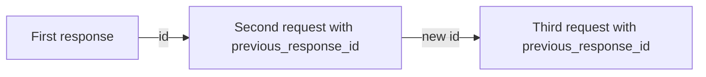

A follow-up request understands earlier turns only if you provide them: either by replaying them yourself, or by pointing at a completed prior response with `previous_response_id`. `previous_response_id` is a shortcut for the common case: it points a new request at a completed prior response so you don't have to resend the conversation yourself.

## Replay conversation turns yourself

Send the next turn as an `input` array that includes the prior turns. Each turn is a message item with `type: "message"` and a `role` (`user` or `assistant`). Append the new question at the end.

<CodeGroup>
  ```python Python theme={null}
  from perplexity import Perplexity

  client = Perplexity()

  first = client.responses.create(
      model="openai/gpt-5.6-sol",
      input="My favorite programming language is Rust.",
  )
  print(first.output_text)

  # Replay the conversation so far, then add the follow-up.
  second = client.responses.create(
      model="openai/gpt-5.6-sol",
      input=[
          {"type": "message", "role": "user", "content": "My favorite programming language is Rust."},
          {"type": "message", "role": "assistant", "content": first.output_text},
          {"type": "message", "role": "user", "content": "What's a good beginner project to practice it?"},
      ],
  )
  print(second.output_text)
  ```

  ```typescript TypeScript theme={null}
  import Perplexity from '@perplexity-ai/perplexity_ai';

  const client = new Perplexity();

  const first = await client.responses.create({
    model: 'openai/gpt-5.6-sol',
    input: 'My favorite programming language is Rust.',
  });
  console.log(first.output_text);

  const second = await client.responses.create({
    model: 'openai/gpt-5.6-sol',
    input: [
      { type: 'message', role: 'user', content: 'My favorite programming language is Rust.' },
      { type: 'message', role: 'assistant', content: first.output_text ?? '' },
      { type: 'message', role: 'user', content: "What's a good beginner project to practice it?" },
    ],
  });
  console.log(second.output_text);
  ```

  ```bash cURL theme={null}
  FIRST=$(curl -s https://api.perplexity.ai/v1/agent \
    -H "Authorization: Bearer $PERPLEXITY_API_KEY" \
    -H "Content-Type: application/json" \
    -d '{
      "model": "openai/gpt-5.6-sol",
      "input": "My favorite programming language is Rust."
    }')
  FIRST_TEXT=$(echo "$FIRST" | jq -r '.output[] | select(.type == "message") | .content[0].text')

  # Replay the conversation so far, then add the follow-up.
  curl https://api.perplexity.ai/v1/agent \
    -H "Authorization: Bearer $PERPLEXITY_API_KEY" \
    -H "Content-Type: application/json" \
    -d "$(jq -n --arg text "$FIRST_TEXT" '{
      model: "openai/gpt-5.6-sol",
      input: [
        { type: "message", role: "user", content: "My favorite programming language is Rust." },
        { type: "message", role: "assistant", content: $text },
        { type: "message", role: "user", content: "What'\''s a good beginner project to practice it?" }
      ]
    }')" | jq
  ```
</CodeGroup>

This gives you full control over exactly what context is sent: summarize, redact, reorder, or drop earlier turns before the follow-up. The tradeoff is that you carry the conversation yourself and resend it on every call.

## Resume from a prior response

Instead of resending the conversation, point the next request at a completed prior response and send only the new turn.

<Info>
  The Agent API persists response and conversation state server-side so responses can be retrieved (`store`) or continued (`previous_response_id`). Setting `store: false` only hides a response from retrieval — it does not disable persistence, and the response can still be used as a continuation source. If your account has a Zero Data Retention (ZDR) agreement with Perplexity, check with your account team before relying on stateful features — contact [api@perplexity.ai](mailto:api@perplexity.ai).
</Info>

1. Create the first response and keep its `id`.
2. Send the follow-up with `previous_response_id` set to that `id`.
3. Put only the new user turn in `input`.

<CodeGroup>
  ```python Python theme={null}
  from perplexity import Perplexity

  client = Perplexity()

  first = client.responses.create(
      model="openai/gpt-5.6-sol",
      input="My favorite programming language is Rust.",
      store=True,
  )
  print(first.id)

  follow_up = client.responses.create(
      model="openai/gpt-5.6-sol",
      previous_response_id=first.id,
      input="What's my favorite programming language?",
  )
  print(follow_up.output_text)
  ```

  ```typescript Typescript theme={null}
  import Perplexity from '@perplexity-ai/perplexity_ai';

  const client = new Perplexity();

  const first = await client.responses.create({
    model: 'openai/gpt-5.6-sol',
    input: 'My favorite programming language is Rust.',
    store: true,
  });
  console.log(first.id);

  const followUp = await client.responses.create({
    model: 'openai/gpt-5.6-sol',
    previous_response_id: first.id,
    input: "What's my favorite programming language?",
  });
  console.log(followUp.output_text);
  ```

  ```bash cURL theme={null}
  FIRST_ID=$(curl https://api.perplexity.ai/v1/agent \
    -H "Authorization: Bearer $PERPLEXITY_API_KEY" \
    -H "Content-Type: application/json" \
    -d '{
      "model": "openai/gpt-5.6-sol",
      "input": "My favorite programming language is Rust.",
      "store": true
    }' | jq -r '.id')

  curl https://api.perplexity.ai/v1/agent \
    -H "Authorization: Bearer $PERPLEXITY_API_KEY" \
    -H "Content-Type: application/json" \
    -d "{
      \"model\": \"openai/gpt-5.6-sol\",
      \"previous_response_id\": \"$FIRST_ID\",
      \"input\": \"What's my favorite programming language?\"
    }" | jq
  ```
</CodeGroup>

### How continuity works

The new request continues from the prior response's saved conversation state. That state includes the prior chain, so you can continue from the latest response in a multi-turn thread instead of manually replaying every earlier turn.



Use this for conversational follow-ups where the next turn should build on earlier user and assistant messages. Continue sending any new instructions, tools, or model settings that you want to apply to the new response.

### Retrieve a response

Fetch a completed response later by its `id`. This does not start a new turn; it returns a JSON snapshot of the original response.

<CodeGroup>
  ```python Python theme={null}
  from perplexity import Perplexity

  client = Perplexity()

  first = client.responses.create(
      model="openai/gpt-5.6-sol",
      input="My favorite programming language is Rust.",
  )

  response = client.responses.retrieve(first.id)
  print(response.status)
  for item in response.output:
      if item.type == "message":
          print(item.content[0].text)
  ```

  ```typescript Typescript theme={null}
  import Perplexity from '@perplexity-ai/perplexity_ai';

  const client = new Perplexity();

  const first = await client.responses.create({
    model: 'openai/gpt-5.6-sol',
    input: 'My favorite programming language is Rust.',
  });

  const response = await client.responses.retrieve(first.id);
  console.log(response.status);
  for (const item of response.output) {
    if (item.type === 'message') {
      console.log(item.content[0].text);
    }
  }
  ```

  ```bash cURL theme={null}
  FIRST_ID=$(curl https://api.perplexity.ai/v1/agent \
    -H "Authorization: Bearer $PERPLEXITY_API_KEY" \
    -H "Content-Type: application/json" \
    -d '{
      "model": "openai/gpt-5.6-sol",
      "input": "My favorite programming language is Rust."
    }' | jq -r '.id') && curl https://api.perplexity.ai/v1/agent/$FIRST_ID \
    -H "Authorization: Bearer $PERPLEXITY_API_KEY" | jq
  ```
</CodeGroup>

Retrieval only works for responses created with `store` omitted or `true`; a `store: false` response returns a `404` on retrieval. For a response you need to be able to retrieve reliably, create it with `background: true`.

### Storage behavior

`store` controls whether a response is visible through user-facing retrieval surfaces. It does not prevent that response from being used as a `previous_response_id` continuation source.

| Setting           | Behavior                                                                                               |
| ----------------- | ------------------------------------------------------------------------------------------------------ |
| Omitted or `true` | The response can be retrieved later and can be used as `previous_response_id`.                         |
| `false`           | The response is hidden from user-facing retrieval, but it can still be used as `previous_response_id`. |

Use `store: false` when you do not want the response exposed through retrieval, but still need the next request in your application flow to continue from it. For example, retrieving a `store: false` response returns a `404`, but you can still continue from it with `previous_response_id`:

<CodeGroup>
  ```python Python theme={null}
  from perplexity import Perplexity

  client = Perplexity()

  hidden = client.responses.create(
      model="openai/gpt-5.6-sol",
      input="My favorite programming language is Rust.",
      store=False,
  )

  try:
      client.responses.retrieve(hidden.id)
  except Exception as e:
      print(e)  # 404 NotFoundError

  follow_up = client.responses.create(
      model="openai/gpt-5.6-sol",
      previous_response_id=hidden.id,  # still works
      input="What's my favorite programming language?",
  )
  print(follow_up.output_text)
  ```

  ```typescript Typescript theme={null}
  import Perplexity from '@perplexity-ai/perplexity_ai';

  const client = new Perplexity();

  const hidden = await client.responses.create({
    model: 'openai/gpt-5.6-sol',
    input: 'My favorite programming language is Rust.',
    store: false,
  });

  try {
    await client.responses.retrieve(hidden.id);
  } catch (e) {
    console.log(e); // 404 NotFoundError
  }

  const followUp = await client.responses.create({
    model: 'openai/gpt-5.6-sol',
    previous_response_id: hidden.id, // still works
    input: "What's my favorite programming language?",
  });
  console.log(followUp.output_text);
  ```

  ```bash cURL theme={null}
  HIDDEN_ID=$(curl https://api.perplexity.ai/v1/agent \
    -H "Authorization: Bearer $PERPLEXITY_API_KEY" \
    -H "Content-Type: application/json" \
    -d '{
      "model": "openai/gpt-5.6-sol",
      "input": "My favorite programming language is Rust.",
      "store": false
    }' | jq -r '.id')

  curl https://api.perplexity.ai/v1/agent/$HIDDEN_ID \
    -H "Authorization: Bearer $PERPLEXITY_API_KEY"
  # -> 404 {"error":{"message":"resource not found", ...}}

  curl https://api.perplexity.ai/v1/agent \
    -H "Authorization: Bearer $PERPLEXITY_API_KEY" \
    -H "Content-Type: application/json" \
    -d "{
      \"model\": \"openai/gpt-5.6-sol\",
      \"previous_response_id\": \"$HIDDEN_ID\",
      \"input\": \"What's my favorite programming language?\"
    }" | jq
  # -> still works
  ```
</CodeGroup>

### Requirements and errors

* `previous_response_id` must reference a prior Agent API response from the same account.
* The prior response must be completed. If it is still running, has failed, or the id cannot be resolved, the API returns a `400` error instead of starting a valid follow-up.
* If you need to continue from a response that is still running, wait for it to complete and retry with the same `previous_response_id`.

## Next steps

<CardGroup cols={2}>
  <Card title="Image Attachments" icon="eye" href="/docs/agent-api/image-attachments">
    Attach images to a request.
  </Card>

  <Card title="Output Control" icon="sliders" href="/docs/agent-api/output-control">
    Control streaming, background runs, error handling, and structured output.
  </Card>
</CardGroup>
