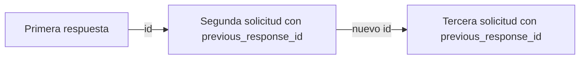

Una solicitud de seguimiento solo tendrá en cuenta los turnos anteriores si se los proporcionas: ya sea reenviándolos tú mismo o haciendo referencia a una respuesta anterior ya completada mediante `previous_response_id`. `previous_response_id` es un atajo para el caso más habitual: vincula una nueva solicitud con una respuesta anterior ya completada, de modo que no tengas que reenviar la conversación por tu cuenta.

<div id="replay-conversation-turns-yourself">
  ## Reproduce los turnos de conversación por tu cuenta
</div>

Envía el siguiente turno como un arreglo `input` que incluya los turnos anteriores. Cada turno es un elemento de mensaje con `type: "message"` y un `role` (`user` o `assistant`). Añade la nueva pregunta al final.

<CodeGroup>
  ```python Python theme={null}
  from perplexity import Perplexity

  client = Perplexity()

  first = client.responses.create(
      model="openai/gpt-5.6-sol",
      input="My favorite programming language is Rust.",
  )
  print(first.output_text)

  # Reproduce la conversación hasta el momento y luego añade la pregunta de seguimiento.
  second = client.responses.create(
      model="openai/gpt-5.6-sol",
      input=[
          {"type": "message", "role": "user", "content": "My favorite programming language is Rust."},
          {"type": "message", "role": "assistant", "content": first.output_text},
          {"type": "message", "role": "user", "content": "What's a good beginner project to practice it?"},
      ],
  )
  print(second.output_text)
  ```

  ```typescript TypeScript theme={null}
  import Perplexity from '@perplexity-ai/perplexity_ai';

  const client = new Perplexity();

  const first = await client.responses.create({
    model: 'openai/gpt-5.6-sol',
    input: 'My favorite programming language is Rust.',
  });
  console.log(first.output_text);

  const second = await client.responses.create({
    model: 'openai/gpt-5.6-sol',
    input: [
      { type: 'message', role: 'user', content: 'My favorite programming language is Rust.' },
      { type: 'message', role: 'assistant', content: first.output_text ?? '' },
      { type: 'message', role: 'user', content: "What's a good beginner project to practice it?" },
    ],
  });
  console.log(second.output_text);
  ```

  ```bash cURL theme={null}
  FIRST=$(curl -s https://api.perplexity.ai/v1/agent \
    -H "Authorization: Bearer $PERPLEXITY_API_KEY" \
    -H "Content-Type: application/json" \
    -d '{
      "model": "openai/gpt-5.6-sol",
      "input": "My favorite programming language is Rust."
    }')
  FIRST_TEXT=$(echo "$FIRST" | jq -r '.output[] | select(.type == "message") | .content[0].text')

  # Reproduce la conversación hasta el momento y luego añade la pregunta de seguimiento.
  curl https://api.perplexity.ai/v1/agent \
    -H "Authorization: Bearer $PERPLEXITY_API_KEY" \
    -H "Content-Type: application/json" \
    -d "$(jq -n --arg text "$FIRST_TEXT" '{
      model: "openai/gpt-5.6-sol",
      input: [
        { type: "message", role: "user", content: "My favorite programming language is Rust." },
        { type: "message", role: "assistant", content: $text },
        { type: "message", role: "user", content: "What'\''s a good beginner project to practice it?" }
      ]
    }')" | jq
  ```
</CodeGroup>

Esto te da control total sobre qué contexto se envía exactamente: puedes resumir, censurar, reordenar o descartar turnos anteriores antes de la pregunta de seguimiento. A cambio, eres tú quien mantiene la conversación y debe reenviarla en cada llamada.

<div id="resume-from-a-prior-response">
  ## Retomar a partir de una respuesta anterior
</div>

En lugar de reenviar toda la conversación, dirige la siguiente solicitud a una respuesta anterior ya completada y envía únicamente el nuevo turno.

<Info>
  La Agent API conserva el estado de la respuesta y de la conversación en el servidor, de modo que las respuestas se pueden recuperar (`store`) o continuar (`previous_response_id`). Definir `store: false` solo oculta una respuesta de la recuperación: no desactiva la persistencia, y la respuesta puede seguir usándose como origen de continuación. Si tu cuenta tiene un acuerdo de retención cero de datos (ZDR) con Perplexity, consulta con tu equipo de cuenta antes de depender de funcionalidades con estado; escribe a [api@perplexity.ai](mailto:api@perplexity.ai).
</Info>

1. Crea la primera respuesta y conserva su `id`.
2. Envía el mensaje de seguimiento con `previous_response_id` establecido en ese `id`.
3. Incluye en `input` únicamente el nuevo turno del usuario.

<CodeGroup>
  ```python Python theme={null}
  from perplexity import Perplexity

  client = Perplexity()

  first = client.responses.create(
      model="openai/gpt-5.6-sol",
      input="My favorite programming language is Rust.",
      store=True,
  )
  print(first.id)

  follow_up = client.responses.create(
      model="openai/gpt-5.6-sol",
      previous_response_id=first.id,
      input="What's my favorite programming language?",
  )
  print(follow_up.output_text)
  ```

  ```typescript Typescript theme={null}
  import Perplexity from '@perplexity-ai/perplexity_ai';

  const client = new Perplexity();

  const first = await client.responses.create({
    model: 'openai/gpt-5.6-sol',
    input: 'My favorite programming language is Rust.',
    store: true,
  });
  console.log(first.id);

  const followUp = await client.responses.create({
    model: 'openai/gpt-5.6-sol',
    previous_response_id: first.id,
    input: "What's my favorite programming language?",
  });
  console.log(followUp.output_text);
  ```

  ```bash cURL theme={null}
  FIRST_ID=$(curl https://api.perplexity.ai/v1/agent \
    -H "Authorization: Bearer $PERPLEXITY_API_KEY" \
    -H "Content-Type: application/json" \
    -d '{
      "model": "openai/gpt-5.6-sol",
      "input": "My favorite programming language is Rust.",
      "store": true
    }' | jq -r '.id')

  curl https://api.perplexity.ai/v1/agent \
    -H "Authorization: Bearer $PERPLEXITY_API_KEY" \
    -H "Content-Type: application/json" \
    -d "{
      \"model\": \"openai/gpt-5.6-sol\",
      \"previous_response_id\": \"$FIRST_ID\",
      \"input\": \"What's my favorite programming language?\"
    }" | jq
  ```
</CodeGroup>

<div id="how-continuity-works">
  ### Cómo funciona la continuidad
</div>

La nueva solicitud parte del estado de conversación guardado de la respuesta anterior. Ese estado incluye la cadena previa, por lo que puedes continuar desde la última respuesta de un hilo de varios turnos en lugar de repetir manualmente cada turno anterior.



Usa esto para seguimientos conversacionales en los que el siguiente turno debe basarse en los mensajes previos del usuario y del asistente. Sigue enviando las nuevas instrucciones, herramientas o configuraciones del model que quieras aplicar a la nueva respuesta.

<div id="retrieve-a-response">
  ### Recuperar una respuesta
</div>

Obtén posteriormente una respuesta ya completada mediante su `id`. Esto no inicia un nuevo turno; devuelve una instantánea en JSON de la respuesta original.

<CodeGroup>
  ```python Python theme={null}
  from perplexity import Perplexity

  client = Perplexity()

  first = client.responses.create(
      model="openai/gpt-5.6-sol",
      input="My favorite programming language is Rust.",
  )

  response = client.responses.retrieve(first.id)
  print(response.status)
  for item in response.output:
      if item.type == "message":
          print(item.content[0].text)
  ```

  ```typescript Typescript theme={null}
  import Perplexity from '@perplexity-ai/perplexity_ai';

  const client = new Perplexity();

  const first = await client.responses.create({
    model: 'openai/gpt-5.6-sol',
    input: 'My favorite programming language is Rust.',
  });

  const response = await client.responses.retrieve(first.id);
  console.log(response.status);
  for (const item of response.output) {
    if (item.type === 'message') {
      console.log(item.content[0].text);
    }
  }
  ```

  ```bash cURL theme={null}
  FIRST_ID=$(curl https://api.perplexity.ai/v1/agent \
    -H "Authorization: Bearer $PERPLEXITY_API_KEY" \
    -H "Content-Type: application/json" \
    -d '{
      "model": "openai/gpt-5.6-sol",
      "input": "My favorite programming language is Rust."
    }' | jq -r '.id') && curl https://api.perplexity.ai/v1/agent/$FIRST_ID \
    -H "Authorization: Bearer $PERPLEXITY_API_KEY" | jq
  ```
</CodeGroup>

La recuperación solo funciona con respuestas creadas con `store` omitido o en `true`; una respuesta con `store: false` devuelve un `404` al intentar recuperarla. Si necesitas poder recuperar una respuesta de forma fiable, créala con `background: true`.

<div id="storage-behavior">
  ### Comportamiento de almacenamiento
</div>

`store` controla si una respuesta es visible en las superficies de recuperación orientadas al usuario. No impide que esa respuesta se use como origen de continuación mediante `previous_response_id`.

| Valor            | Comportamiento                                                                                                           |
| ---------------- | ------------------------------------------------------------------------------------------------------------------------ |
| Omitido o `true` | La respuesta se puede recuperar más tarde y se puede usar como `previous_response_id`.                                   |
| `false`          | La respuesta queda oculta para la recuperación orientada al usuario, pero aún se puede usar como `previous_response_id`. |

Usa `store: false` cuando no quieras exponer la respuesta mediante la recuperación, pero aun así necesites que la siguiente solicitud del flujo de tu aplicación continúe a partir de ella. Por ejemplo, recuperar una respuesta con `store: false` devuelve un `404`, pero aun así puedes continuar a partir de ella con `previous_response_id`:

<CodeGroup>
  ```python Python theme={null}
  from perplexity import Perplexity

  client = Perplexity()

  hidden = client.responses.create(
      model="openai/gpt-5.6-sol",
      input="My favorite programming language is Rust.",
      store=False,
  )

  try:
      client.responses.retrieve(hidden.id)
  except Exception as e:
      print(e)  # 404 NotFoundError

  follow_up = client.responses.create(
      model="openai/gpt-5.6-sol",
      previous_response_id=hidden.id,  # sigue funcionando
      input="What's my favorite programming language?",
  )
  print(follow_up.output_text)
  ```

  ```typescript Typescript theme={null}
  import Perplexity from '@perplexity-ai/perplexity_ai';

  const client = new Perplexity();

  const hidden = await client.responses.create({
    model: 'openai/gpt-5.6-sol',
    input: 'My favorite programming language is Rust.',
    store: false,
  });

  try {
    await client.responses.retrieve(hidden.id);
  } catch (e) {
    console.log(e); // 404 NotFoundError
  }

  const followUp = await client.responses.create({
    model: 'openai/gpt-5.6-sol',
    previous_response_id: hidden.id, // sigue funcionando
    input: "What's my favorite programming language?",
  });
  console.log(followUp.output_text);
  ```

  ```bash cURL theme={null}
  HIDDEN_ID=$(curl https://api.perplexity.ai/v1/agent \
    -H "Authorization: Bearer $PERPLEXITY_API_KEY" \
    -H "Content-Type: application/json" \
    -d '{
      "model": "openai/gpt-5.6-sol",
      "input": "My favorite programming language is Rust.",
      "store": false
    }' | jq -r '.id')

  curl https://api.perplexity.ai/v1/agent/$HIDDEN_ID \
    -H "Authorization: Bearer $PERPLEXITY_API_KEY"
  # -> 404 {"error":{"message":"resource not found", ...}}

  curl https://api.perplexity.ai/v1/agent \
    -H "Authorization: Bearer $PERPLEXITY_API_KEY" \
    -H "Content-Type: application/json" \
    -d "{
      \"model\": \"openai/gpt-5.6-sol\",
      \"previous_response_id\": \"$HIDDEN_ID\",
      \"input\": \"What's my favorite programming language?\"
    }" | jq
  # -> sigue funcionando
  ```
</CodeGroup>

<div id="requirements-and-errors">
  ### Requisitos y errores
</div>

* `previous_response_id` debe hacer referencia a una respuesta anterior de la Agent API de la misma cuenta.
* La respuesta anterior debe estar completada. Si todavía se está ejecutando, ha fallado o no se puede resolver el id, la API devuelve un error `400` en lugar de iniciar un seguimiento válido.
* Si necesitas continuar a partir de una respuesta que todavía se está ejecutando, espera a que finalice y vuelve a intentarlo con el mismo `previous_response_id`.

<div id="next-steps">
  ## Próximos pasos
</div>

<CardGroup cols={2}>
  <Card title="Imágenes adjuntas" icon="eye" href="/es/docs/agent-api/image-attachments">
    Adjunta imágenes a una solicitud.
  </Card>

  <Card title="Control de la salida" icon="sliders" href="/es/docs/agent-api/output-control">
    Controla el streaming, las ejecuciones en segundo plano, el manejo de errores y la salida estructurada.
  </Card>
</CardGroup>