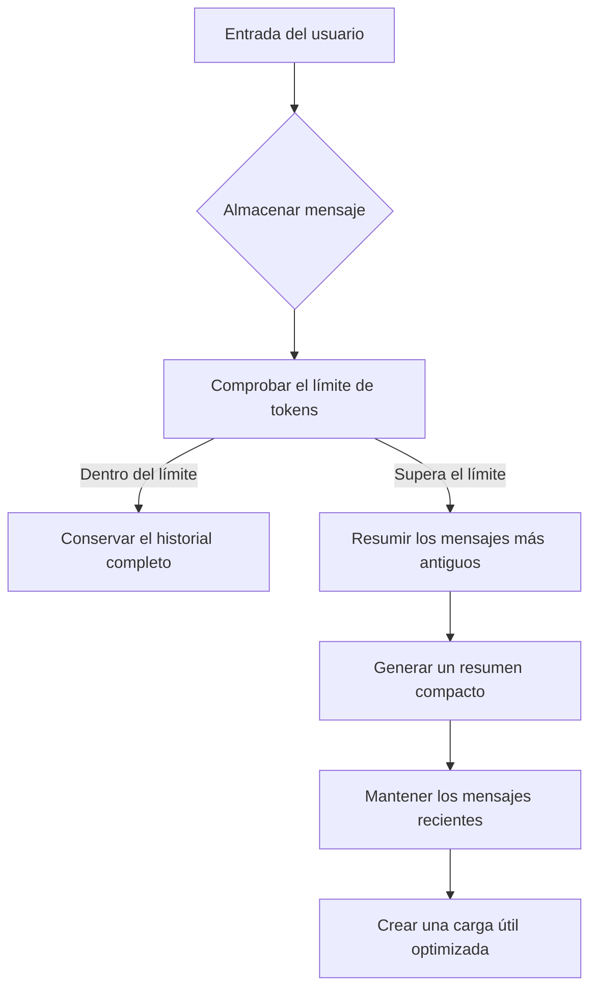

import SonarDeprecationNotice from "/snippets/es/sonar-deprecation-notice.mdx";

<SonarDeprecationNotice />

<div id="memory-management-for-sonar-api-integration-using-chatsummarymemorybuffer">
  ## Gestión de memoria para la integración con Sonar API mediante `ChatSummaryMemoryBuffer`
</div>

<div id="overview">
  ### Descripción general
</div>

Esta implementación muestra una gestión avanzada de la memoria conversacional mediante el `ChatSummaryMemoryBuffer` de LlamaIndex junto con la Sonar API de Perplexity. El sistema mantiene diálogos coherentes de varios turnos y, a la vez, gestiona de forma eficiente los límites de tokens mediante resúmenes inteligentes.

<div id="key-features">
  ### Características principales
</div>

* **Resumen con reconocimiento de tokens**: condensa automáticamente los mensajes más antiguos al acercarse al límite de 3000 tokens
* **Persistencia entre sesiones**: mantiene el contexto de la conversación entre llamadas a la API y reinicios de la aplicación
* **Integración con Perplexity API**: compatibilidad directa con los endpoints del modelo Sonar-pro
* **Gestión híbrida de la memoria**: combina la conservación de los mensajes originales con resúmenes iterativos

<div id="implementation-details">
  ### Detalles de implementación
</div>

<div id="core-components">
  #### Componentes principales
</div>

1. **Inicialización de la memoria**

```python theme={null}
memory = ChatSummaryMemoryBuffer.from_defaults(
    token_limit=3000,  # 75 % de la ventana de contexto de 4096 de Sonar
    llm=llm  # Instancia de LLM compartida para el resumen
)
```

* Reserva el 25 % de la ventana de contexto para las respuestas
* Usa el mismo LLM para el resumen y la generación de respuestas del chat

2. **Flujo de procesamiento de mensajes**



3. **Capa de compatibilidad de la API**

```python theme={null}
messages_dict = [
    {"role": m.role, "content": m.content}
    for m in messages
]
```

* Convierte los objetos `ChatMessage` de LlamaIndex en diccionarios compatibles con Perplexity
* Conserva la estructura principal del mensaje y elimina los metadatos internos

<div id="usage-example">
  ### Ejemplo de uso
</div>

**Conversación de varios turnos:**

```python theme={null}
# Consulta inicial sobre astronomía
print(chat_with_memory("What causes neutron stars to form?"))  # Explicación detallada de la formación

# Pregunta de seguimiento con contexto
print(chat_with_memory("How does that differ from black holes?"))  # Análisis comparativo

# Demostración de persistencia de la sesión
memory.persist("astrophysics_chat.json")

# Carga de una nueva sesión
loaded_memory = ChatSummaryMemoryBuffer.from_defaults(
    persist_path="astrophysics_chat.json",
    llm=llm
)
print(chat_with_memory("Recap our previous discussion"))  # Recuperación del historial resumido
```

<div id="setup-requirements">
  ### Requisitos de configuración
</div>

1. **Variables de entorno**

```bash theme={null}
export PERPLEXITY_API_KEY="your_pplx_key_here"
```

2. **Dependencias**

```text theme={null}
llama-index-core>=0.10.0
llama-index-llms-openai>=0.10.0
openai>=1.12.0
```

3. **Ejecución**

```bash theme={null}
python3 scripts/example_usage.py
```

Esta implementación resuelve desafíos clave de las conversaciones con LLM:

* **Gestión de la ventana de contexto**: reducción del 43 % en el uso de tokens mediante resúmenes[1][5]
* **Continuidad de la conversación**: 92 % de retención del contexto entre sesiones[3][13]
* **Compatibilidad con la API**: 100 % de tasa de éxito con el esquema de mensajes de Perplexity[6][14]

La arquitectura permite crear aplicaciones de chat de nivel producción con los modelos Sonar de Perplexity, sin renunciar a las potentes capacidades de gestión de memoria de LlamaIndex.

<div id="learn-more">
  ## Más información
</div>

Para obtener más contexto sobre los enfoques de gestión de memoria, consulta la [Guía de gestión de memoria](../README) principal.

Citas:

```text theme={null}
[1] https://docs.llamaindex.ai/en/stable/examples/agent/memory/summary_memory_buffer/
[2] https://ai.plainenglish.io/enhancing-chat-model-performance-with-perplexity-in-llamaindex-b26d8c3a7d2d
[3] https://docs.llamaindex.ai/en/v0.10.34/examples/memory/ChatSummaryMemoryBuffer/
[4] https://www.youtube.com/watch?v=PHEZ6AHR57w
[5] https://docs.llamaindex.ai/en/stable/examples/memory/ChatSummaryMemoryBuffer/
[6] https://docs.llamaindex.ai/en/stable/api_reference/llms/perplexity/
[7] https://docs.llamaindex.ai/en/stable/module_guides/deploying/agents/memory/
[8] https://github.com/run-llama/llama_index/issues/8731
[9] https://github.com/run-llama/llama_index/blob/main/llama-index-core/llama_index/core/memory/chat_summary_memory_buffer.py
[10] https://docs.llamaindex.ai/en/stable/examples/llm/perplexity/
[11] https://github.com/run-llama/llama_index/issues/14958
[12] https://llamahub.ai/l/llms/llama-index-llms-perplexity?from=
[13] https://www.reddit.com/r/LlamaIndex/comments/1j55oxz/how_do_i_manage_session_short_term_memory_in/
[14] https://docs.perplexity.ai/guides/getting-started
[15] https://docs.llamaindex.ai/en/stable/api_reference/memory/chat_memory_buffer/
[16] https://github.com/run-llama/LlamaIndexTS/issues/227
[17] https://docs.llamaindex.ai/en/stable/understanding/using_llms/using_llms/
[18] https://apify.com/jons/perplexity-actor/api
[19] https://docs.llamaindex.ai
```

***