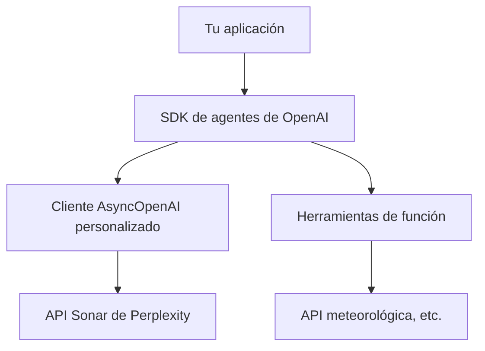

import SonarDeprecationNotice from "/snippets/es/sonar-deprecation-notice.mdx";

<SonarDeprecationNotice />

<div id="what-youll-build">
  ## 🎯 Lo que vas a construir
</div>

Al finalizar esta guía, tendrás:

* ✅ Un cliente asíncrono personalizado de OpenAI configurado para la API Sonar
* ✅ Un agente inteligente con capacidad de llamada a funciones
* ✅ Un ejemplo funcional que obtiene información en tiempo real
* ✅ Patrones de integración listos para producción

<div id="architecture-overview">
  ## 🏗️ Descripción general de la arquitectura
</div>



Esta integración te permite:

1. **Aprovechar las capacidades de búsqueda de Sonar** para obtener respuestas fundamentadas y en tiempo real
2. **Usar el framework de agentes de OpenAI** para interacciones estructuradas y llamadas a funciones
3. **Combinar ambos** para crear aplicaciones potentes y sensibles al contexto

<div id="prerequisites">
  ## 📋 Requisitos previos
</div>

Antes de comenzar, asegúrate de tener:

* **Python 3.7+** instalado
* **Clave de API de Perplexity**: [obtén una aquí](https://docs.perplexity.ai/home)
* Acceso y familiaridad con el **SDK de agentes de OpenAI**

<div id="installation">
  ## 🚀 Instalación
</div>

Instala las dependencias necesarias:

```bash theme={null}
pip install openai nest-asyncio
```

:::info
El paquete `nest-asyncio` es necesario para ejecutar código asíncrono en entornos como los notebooks de Jupyter, que ya tienen un bucle de eventos en ejecución.
:::

<div id="environment-setup">
  ## ⚙️ Configuración del entorno
</div>

Configura tus variables de entorno:

```bash theme={null}
# Obligatorio: tu API key de Perplexity
export EXAMPLE_API_KEY="your-perplexity-api-key"

# Opcional: personaliza el endpoint de la API (por defecto, el endpoint oficial)
export EXAMPLE_BASE_URL="https://api.perplexity.ai"

# Opcional: elige el modelo (por defecto, sonar-pro)
export EXAMPLE_MODEL_NAME="sonar-pro"
```

<div id="complete-implementation">
  ## 💻 Implementación completa
</div>

Esta es la implementación completa, con explicaciones detalladas:

```python theme={null}
# Importar las bibliotecas estándar necesarias
import asyncio  # Para ejecutar código asíncrono
import os       # Para acceder a las variables de entorno

# Importar AsyncOpenAI para crear un cliente asíncrono
from openai import AsyncOpenAI

# Importar clases y funciones personalizadas del paquete agents.
# Se encargan de crear agentes, conectar con el modelo, ejecutar agentes y más.
from agents import Agent, OpenAIChatCompletionsModel, Runner, function_tool, set_tracing_disabled

# Obtener la configuración de las variables de entorno o usar los valores predeterminados
BASE_URL = os.getenv("EXAMPLE_BASE_URL") or "https://api.perplexity.ai"
API_KEY = os.getenv("EXAMPLE_API_KEY") 
MODEL_NAME = os.getenv("EXAMPLE_MODEL_NAME") or "sonar-pro"

# Validar que todas las variables de configuración requeridas estén definidas
if not BASE_URL or not API_KEY or not MODEL_NAME:
    raise ValueError(
        "Please set EXAMPLE_BASE_URL, EXAMPLE_API_KEY, EXAMPLE_MODEL_NAME via env var or code."
    )

# Inicializar el cliente asíncrono personalizado de OpenAI con BASE_URL y API_KEY.
client = AsyncOpenAI(base_url=BASE_URL, api_key=API_KEY)

# Desactivar el rastreo para no tener que usar una clave de rastreo de la plataforma; ajústalo según lo necesites.
set_tracing_disabled(disabled=True)

# Definir una herramienta de función que el agente puede invocar.
# El decorador registra esta función como una herramienta en el framework de agents.
@function_tool
def get_weather(city: str):
    """
    Simulate fetching weather data for a given city.
    
    Args:
        city (str): The name of the city to retrieve weather for.
        
    Returns:
        str: A message with weather information.
    """
    print(f"[debug] getting weather for {city}")
    return f"The weather in {city} is sunny."

# Importar nest_asyncio para admitir bucles de eventos anidados
import nest_asyncio

# Aplicar el parche de nest_asyncio para poder ejecutar asyncio.run()
# incluso si ya hay un bucle de eventos en ejecución.
nest_asyncio.apply()

async def main():
    """
    Main asynchronous function to set up and run the agent.
    
    This function creates an Agent with a custom model and function tools,
    then runs a query to get the weather in Tokyo.
    """
    # Crear una instancia de Agent con:
    # - Un nombre ("Assistant")
    # - Instrucciones personalizadas ("Be precise and concise.")
    # - Un modelo creado a partir de OpenAIChatCompletionsModel con nuestro cliente y nombre de modelo.
    # - Una lista de herramientas; aquí solo se proporciona get_weather.
    agent = Agent(
        name="Assistant",
        instructions="Be precise and concise.",
        model=OpenAIChatCompletionsModel(model=MODEL_NAME, openai_client=client),
        tools=[get_weather],
    )

    # Ejecutar el agente con la consulta de ejemplo.
    result = await Runner.run(agent, "What's the weather in Tokyo?")
    
    # Imprimir la salida final del agente.
    print(result.final_output)

# Código estándar para ejecutar la función asíncrona main().
if __name__ == "__main__":
    asyncio.run(main())
```

<div id="code-breakdown">
  ## 🔍 Desglose del código
</div>

Examinemos los componentes clave:

<div id="1-client-configuration">
  ### 1. **Configuración del cliente**
</div>

```python theme={null}
client = AsyncOpenAI(base_url=BASE_URL, api_key=API_KEY)
```

Esto crea un cliente asíncrono de OpenAI que apunta a la API Sonar de Perplexity. El cliente gestiona toda la comunicación HTTP y mantiene la compatibilidad con la interfaz de OpenAI.

<div id="2-function-tools">
  ### 2. **Herramientas de función**
</div>

```python theme={null}
@function_tool
def get_weather(city: str):
    """Simulate fetching weather data for a given city."""
    return f"The weather in {city} is sunny."
```

Las herramientas de función permiten que tu agente realice acciones más allá de la generación de texto. En producción, esto se reemplazaría por llamadas reales a una API.

<div id="3-agent-creation">
  ### 3. **Creación del agente**
</div>

```python theme={null}
agent = Agent(
    name="Assistant",
    instructions="Be precise and concise.",
    model=OpenAIChatCompletionsModel(model=MODEL_NAME, openai_client=client),
    tools=[get_weather],
)
```

El agente combina las capacidades lingüísticas de Sonar con tus herramientas e instrucciones personalizadas.

<div id="running-the-example">
  ## 🏃‍♂️ Ejecutar el ejemplo
</div>

1. **Define tus variables de entorno**:
   ```bash theme={null}
   export EXAMPLE_API_KEY="your-perplexity-api-key"
   ```

2. **Guarda el código** en un archivo (por ejemplo, `pplx_openai_agent.py`)

3. **Ejecuta el script**:
   ```bash theme={null}
   python pplx_openai_agent.py
   ```

**Resultado esperado**:

```
[debug] getting weather for Tokyo
The weather in Tokyo is sunny.
```

<div id="customization-options">
  ## 🔧 Opciones de personalización
</div>

<div id="different-sonar-models">
  ### **Distintos modelos de Sonar**
</div>

Elige el modelo adecuado para tu caso de uso:

```python theme={null}
# Para consultas rápidas y ligeras
MODEL_NAME = "sonar"

# Para investigación y análisis complejos (predeterminado)
MODEL_NAME = "sonar-pro"

# Para tareas de razonamiento profundo
MODEL_NAME = "sonar-reasoning-pro"
```

<div id="custom-instructions">
  ### **Instrucciones personalizadas**
</div>

Adapta el comportamiento del agente:

```python theme={null}
agent = Agent(
    name="Research Assistant",
    instructions="""
    You are a research assistant specializing in academic literature.
    Always provide citations and verify information through multiple sources.
    Be thorough but concise in your responses.
    """,
    model=OpenAIChatCompletionsModel(model=MODEL_NAME, openai_client=client),
    tools=[search_papers, get_citations],
)
```

<div id="multiple-function-tools">
  ### **Múltiples herramientas de función**
</div>

Agrega más capacidades:

```python theme={null}
@function_tool
def search_web(query: str):
    """Search the web for current information."""
    # Implementación aquí
    pass

@function_tool
def analyze_data(data: str):
    """Analyze structured data."""
    # Implementación aquí
    pass

agent = Agent(
    name="Multi-Tool Assistant",
    instructions="Use the appropriate tool for each task.",
    model=OpenAIChatCompletionsModel(model=MODEL_NAME, openai_client=client),
    tools=[get_weather, search_web, analyze_data],
)
```

<div id="production-considerations">
  ## 🚀 Consideraciones para producción
</div>

<div id="error-handling">
  ### **Manejo de errores**
</div>

```python theme={null}
async def robust_main():
    try:
        agent = Agent(
            name="Assistant",
            instructions="Be helpful and accurate.",
            model=OpenAIChatCompletionsModel(model=MODEL_NAME, openai_client=client),
            tools=[get_weather],
        )
        
        result = await Runner.run(agent, "What's the weather in Tokyo?")
        return result.final_output
        
    except Exception as e:
        print(f"Error running agent: {e}")
        return "Sorry, I encountered an error processing your request."
```

<div id="rate-limiting">
  ### **Límites de tasa**
</div>

```python theme={null}
import aiohttp
from openai import AsyncOpenAI

# Configura el cliente con tiempos de espera y reintentos personalizados
client = AsyncOpenAI(
    base_url=BASE_URL, 
    api_key=API_KEY,
    timeout=30.0,
    max_retries=3
)
```

<div id="logging-and-monitoring">
  ### **Registro y monitorización**
</div>

```python theme={null}
import logging

logging.basicConfig(level=logging.INFO)
logger = logging.getLogger(__name__)

@function_tool
def get_weather(city: str):
    logger.info(f"Fetching weather for {city}")
    # Implementación aquí
```

<div id="advanced-integration-patterns">
  ## 🔗 Patrones de integración avanzados
</div>

<div id="streaming-responses">
  ### **Respuestas en streaming**
</div>

Para aplicaciones en tiempo real:

```python theme={null}
async def stream_agent_response(query: str):
    agent = Agent(
        name="Streaming Assistant",
        instructions="Provide detailed, step-by-step responses.",
        model=OpenAIChatCompletionsModel(model=MODEL_NAME, openai_client=client),
        tools=[get_weather],
    )
    
    async for chunk in Runner.stream(agent, query):
        print(chunk, end='', flush=True)
```

<div id="context-management">
  ### **Gestión del contexto**
</div>

Para conversaciones de varios turnos:

```python theme={null}
class ConversationManager:
    def __init__(self):
        self.agent = Agent(
            name="Conversational Assistant",
            instructions="Maintain context across multiple interactions.",
            model=OpenAIChatCompletionsModel(model=MODEL_NAME, openai_client=client),
            tools=[get_weather],
        )
        self.conversation_history = []
    
    async def chat(self, message: str):
        result = await Runner.run(self.agent, message)
        self.conversation_history.append({"user": message, "assistant": result.final_output})
        return result.final_output
```

<div id="important-notes">
  ## ⚠️ Notas importantes
</div>

* **Costos de API**: Monitorea tu uso, ya que tanto Perplexity como los Agents de OpenAI pueden generar costos
* **Límites de tasa**: Respeta los límites de tasa de la API e implementa estrategias de backoff adecuadas
* **Manejo de errores**: Implementa siempre un manejo de errores robusto en aplicaciones de producción
* **Seguridad**: Mantén tus API keys seguras y nunca las subas al control de versiones

<div id="use-cases">
  ## 🎯 Casos de uso
</div>

Este patrón de integración es ideal para:

* **🔍 Asistentes de investigación**: combinan búsqueda en tiempo real con respuestas estructuradas
* **📊 Herramientas de análisis de datos**: usan Sonar para el contexto y agentes para el procesamiento
* **🤖 Atención al cliente**: respuestas fundamentadas con capacidad de llamada a funciones
* **📚 Aplicaciones educativas**: información en tiempo real con funciones interactivas

<div id="references">
  ## 📚 Referencias
</div>

* [Documentación de la API Sonar de Perplexity](https://docs.perplexity.ai/home)
* [Documentación del SDK de agentes de OpenAI](https://github.com/openai/openai-agents-python)
* [Referencia del cliente AsyncOpenAI](https://platform.openai.com/docs/api-reference)
* [Buenas prácticas de llamada a funciones](https://platform.openai.com/docs/guides/function-calling)

***

**¿Todo listo para empezar?** Esta integración abre grandes posibilidades para crear agentes inteligentes y fundamentados. Empieza con el ejemplo básico y ve incorporando herramientas y capacidades cada vez más sofisticadas. 🚀