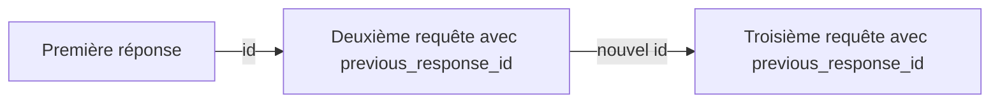

Une requête de suivi ne tient compte des tours de conversation précédents que si vous les fournissez : soit en les renvoyant vous-même, soit en référençant une réponse précédente terminée via `previous_response_id`. `previous_response_id` est un raccourci pour le cas le plus courant : il rattache une nouvelle requête à une réponse précédente terminée, ce qui vous évite de renvoyer vous-même l&#39;ensemble de la conversation.

<div id="replay-conversation-turns-yourself">
  ## Rejouer vous-même les tours de conversation
</div>

Envoyez le tour de conversation suivant sous forme de tableau `input` contenant les tours de conversation précédents. Chaque tour de conversation est un élément de message doté d&#39;un `type: "message"` et d&#39;un `role` (`user` ou `assistant`). Ajoutez la nouvelle question à la fin.

<CodeGroup>
  ```python Python theme={null}
  from perplexity import Perplexity

  client = Perplexity()

  first = client.responses.create(
      model="openai/gpt-5.6-sol",
      input="My favorite programming language is Rust.",
  )
  print(first.output_text)

  # Rejouer la conversation jusqu'ici, puis ajouter la question de suivi.
  second = client.responses.create(
      model="openai/gpt-5.6-sol",
      input=[
          {"type": "message", "role": "user", "content": "My favorite programming language is Rust."},
          {"type": "message", "role": "assistant", "content": first.output_text},
          {"type": "message", "role": "user", "content": "What's a good beginner project to practice it?"},
      ],
  )
  print(second.output_text)
  ```

  ```typescript TypeScript theme={null}
  import Perplexity from '@perplexity-ai/perplexity_ai';

  const client = new Perplexity();

  const first = await client.responses.create({
    model: 'openai/gpt-5.6-sol',
    input: 'My favorite programming language is Rust.',
  });
  console.log(first.output_text);

  const second = await client.responses.create({
    model: 'openai/gpt-5.6-sol',
    input: [
      { type: 'message', role: 'user', content: 'My favorite programming language is Rust.' },
      { type: 'message', role: 'assistant', content: first.output_text ?? '' },
      { type: 'message', role: 'user', content: "What's a good beginner project to practice it?" },
    ],
  });
  console.log(second.output_text);
  ```

  ```bash cURL theme={null}
  FIRST=$(curl -s https://api.perplexity.ai/v1/agent \
    -H "Authorization: Bearer $PERPLEXITY_API_KEY" \
    -H "Content-Type: application/json" \
    -d '{
      "model": "openai/gpt-5.6-sol",
      "input": "My favorite programming language is Rust."
    }')
  FIRST_TEXT=$(echo "$FIRST" | jq -r '.output[] | select(.type == "message") | .content[0].text')

  # Rejouer la conversation jusqu'ici, puis ajouter la question de suivi.
  curl https://api.perplexity.ai/v1/agent \
    -H "Authorization: Bearer $PERPLEXITY_API_KEY" \
    -H "Content-Type: application/json" \
    -d "$(jq -n --arg text "$FIRST_TEXT" '{
      model: "openai/gpt-5.6-sol",
      input: [
        { type: "message", role: "user", content: "My favorite programming language is Rust." },
        { type: "message", role: "assistant", content: $text },
        { type: "message", role: "user", content: "What'\''s a good beginner project to practice it?" }
      ]
    }')" | jq
  ```
</CodeGroup>

Vous gardez ainsi un contrôle total sur le contexte réellement transmis : vous pouvez résumer, masquer, réordonner ou supprimer les tours de conversation antérieurs avant la requête de suivi. En contrepartie, c&#39;est à vous de gérer la conversation et de la renvoyer à chaque appel.

<div id="resume-from-a-prior-response">
  ## Reprendre à partir d&#39;une réponse précédente
</div>

Plutôt que de renvoyer toute la conversation, pointez la requête suivante vers une réponse précédente terminée et n&#39;envoyez que le nouveau tour de conversation.

<Info>
  L&#39;Agent API conserve l&#39;état des réponses et des conversations côté serveur, ce qui permet de récupérer les réponses (`store`) ou de les poursuivre (`previous_response_id`). Définir `store: false` masque simplement une réponse lors de la récupération — cela ne désactive pas la persistance, et la réponse peut toujours servir de point de départ à une continuation. Si votre compte est couvert par un accord Zero Data Retention (ZDR) avec Perplexity, consultez votre équipe de compte avant de vous appuyer sur des fonctionnalités à état — écrivez à [api@perplexity.ai](mailto:api@perplexity.ai).
</Info>

1. Créez la première réponse et conservez son `id`.
2. Envoyez la requête de suivi en définissant `previous_response_id` sur cet `id`.
3. Ne placez que le nouveau tour de conversation de l&#39;utilisateur dans `input`.

<CodeGroup>
  ```python Python theme={null}
  from perplexity import Perplexity

  client = Perplexity()

  first = client.responses.create(
      model="openai/gpt-5.6-sol",
      input="My favorite programming language is Rust.",
      store=True,
  )
  print(first.id)

  follow_up = client.responses.create(
      model="openai/gpt-5.6-sol",
      previous_response_id=first.id,
      input="What's my favorite programming language?",
  )
  print(follow_up.output_text)
  ```

  ```typescript Typescript theme={null}
  import Perplexity from '@perplexity-ai/perplexity_ai';

  const client = new Perplexity();

  const first = await client.responses.create({
    model: 'openai/gpt-5.6-sol',
    input: 'My favorite programming language is Rust.',
    store: true,
  });
  console.log(first.id);

  const followUp = await client.responses.create({
    model: 'openai/gpt-5.6-sol',
    previous_response_id: first.id,
    input: "What's my favorite programming language?",
  });
  console.log(followUp.output_text);
  ```

  ```bash cURL theme={null}
  FIRST_ID=$(curl https://api.perplexity.ai/v1/agent \
    -H "Authorization: Bearer $PERPLEXITY_API_KEY" \
    -H "Content-Type: application/json" \
    -d '{
      "model": "openai/gpt-5.6-sol",
      "input": "My favorite programming language is Rust.",
      "store": true
    }' | jq -r '.id')

  curl https://api.perplexity.ai/v1/agent \
    -H "Authorization: Bearer $PERPLEXITY_API_KEY" \
    -H "Content-Type: application/json" \
    -d "{
      \"model\": \"openai/gpt-5.6-sol\",
      \"previous_response_id\": \"$FIRST_ID\",
      \"input\": \"What's my favorite programming language?\"
    }" | jq
  ```
</CodeGroup>

<div id="how-continuity-works">
  ### Fonctionnement de la continuité
</div>

La nouvelle requête reprend à partir de l&#39;état de la conversation enregistré de la réponse précédente. Cet état inclut la chaîne antérieure : vous pouvez donc reprendre depuis la dernière réponse d&#39;un fil multi-tours, sans avoir à rejouer manuellement chaque tour de conversation précédent.



Utilisez cette approche pour les requêtes de suivi conversationnelles dans lesquelles le tour de conversation suivant doit s&#39;appuyer sur les messages précédents de l&#39;utilisateur et de l&#39;assistant. Continuez d&#39;envoyer les nouvelles instructions, les nouveaux outils ou les paramètres de model que vous souhaitez appliquer à la nouvelle réponse.

<div id="retrieve-a-response">
  ### Récupérer une réponse
</div>

Récupérez ultérieurement une réponse terminée à partir de son `id`. Cela ne démarre pas un nouveau tour de conversation : l&#39;appel renvoie un instantané JSON de la réponse d&#39;origine.

<CodeGroup>
  ```python Python theme={null}
  from perplexity import Perplexity

  client = Perplexity()

  first = client.responses.create(
      model="openai/gpt-5.6-sol",
      input="My favorite programming language is Rust.",
  )

  response = client.responses.retrieve(first.id)
  print(response.status)
  for item in response.output:
      if item.type == "message":
          print(item.content[0].text)
  ```

  ```typescript Typescript theme={null}
  import Perplexity from '@perplexity-ai/perplexity_ai';

  const client = new Perplexity();

  const first = await client.responses.create({
    model: 'openai/gpt-5.6-sol',
    input: 'My favorite programming language is Rust.',
  });

  const response = await client.responses.retrieve(first.id);
  console.log(response.status);
  for (const item of response.output) {
    if (item.type === 'message') {
      console.log(item.content[0].text);
    }
  }
  ```

  ```bash cURL theme={null}
  FIRST_ID=$(curl https://api.perplexity.ai/v1/agent \
    -H "Authorization: Bearer $PERPLEXITY_API_KEY" \
    -H "Content-Type: application/json" \
    -d '{
      "model": "openai/gpt-5.6-sol",
      "input": "My favorite programming language is Rust."
    }' | jq -r '.id') && curl https://api.perplexity.ai/v1/agent/$FIRST_ID \
    -H "Authorization: Bearer $PERPLEXITY_API_KEY" | jq
  ```
</CodeGroup>

La récupération ne fonctionne que pour les réponses créées avec `store` omis ou défini sur `true` ; une réponse créée avec `store: false` renvoie une erreur `404` à la récupération. Si vous devez pouvoir récupérer une réponse de façon fiable, créez-la avec `background: true`.

<div id="storage-behavior">
  ### Comportement de stockage
</div>

`store` détermine si une réponse est visible via les surfaces de récupération exposées aux utilisateurs. Cela n&#39;empêche pas d&#39;utiliser cette réponse comme source de continuation `previous_response_id`.

| Paramètre      | Comportement                                                                                                                  |
| -------------- | ----------------------------------------------------------------------------------------------------------------------------- |
| Omis ou `true` | La réponse peut être récupérée ultérieurement et utilisée comme `previous_response_id`.                                       |
| `false`        | La réponse est masquée de la récupération exposée aux utilisateurs, mais elle peut toujours servir de `previous_response_id`. |

Utilisez `store: false` lorsque vous ne souhaitez pas exposer la réponse via la récupération, tout en permettant à la requête suivante de votre flux applicatif de la poursuivre. Par exemple, la récupération d&#39;une réponse en `store: false` renvoie une erreur `404`, mais vous pouvez malgré tout la poursuivre avec `previous_response_id` :

<CodeGroup>
  ```python Python theme={null}
  from perplexity import Perplexity

  client = Perplexity()

  hidden = client.responses.create(
      model="openai/gpt-5.6-sol",
      input="My favorite programming language is Rust.",
      store=False,
  )

  try:
      client.responses.retrieve(hidden.id)
  except Exception as e:
      print(e)  # 404 NotFoundError

  follow_up = client.responses.create(
      model="openai/gpt-5.6-sol",
      previous_response_id=hidden.id,  # fonctionne quand même
      input="What's my favorite programming language?",
  )
  print(follow_up.output_text)
  ```

  ```typescript Typescript theme={null}
  import Perplexity from '@perplexity-ai/perplexity_ai';

  const client = new Perplexity();

  const hidden = await client.responses.create({
    model: 'openai/gpt-5.6-sol',
    input: 'My favorite programming language is Rust.',
    store: false,
  });

  try {
    await client.responses.retrieve(hidden.id);
  } catch (e) {
    console.log(e); // 404 NotFoundError
  }

  const followUp = await client.responses.create({
    model: 'openai/gpt-5.6-sol',
    previous_response_id: hidden.id, // fonctionne quand même
    input: "What's my favorite programming language?",
  });
  console.log(followUp.output_text);
  ```

  ```bash cURL theme={null}
  HIDDEN_ID=$(curl https://api.perplexity.ai/v1/agent \
    -H "Authorization: Bearer $PERPLEXITY_API_KEY" \
    -H "Content-Type: application/json" \
    -d '{
      "model": "openai/gpt-5.6-sol",
      "input": "My favorite programming language is Rust.",
      "store": false
    }' | jq -r '.id')

  curl https://api.perplexity.ai/v1/agent/$HIDDEN_ID \
    -H "Authorization: Bearer $PERPLEXITY_API_KEY"
  # -> 404 {"error":{"message":"resource not found", ...}}

  curl https://api.perplexity.ai/v1/agent \
    -H "Authorization: Bearer $PERPLEXITY_API_KEY" \
    -H "Content-Type: application/json" \
    -d "{
      \"model\": \"openai/gpt-5.6-sol\",
      \"previous_response_id\": \"$HIDDEN_ID\",
      \"input\": \"What's my favorite programming language?\"
    }" | jq
  # -> fonctionne quand même
  ```
</CodeGroup>

<div id="requirements-and-errors">
  ### Prérequis et erreurs
</div>

* `previous_response_id` doit faire référence à une réponse Agent API précédente du même compte.
* La réponse précédente doit être terminée. Si elle est encore en cours d&#39;exécution, si elle a échoué ou si l&#39;identifiant ne peut pas être résolu, l&#39;API renvoie une erreur `400` au lieu d&#39;engager une requête de suivi valide.
* Si vous devez reprendre à partir d&#39;une réponse encore en cours d&#39;exécution, attendez qu&#39;elle se termine, puis réessayez avec le même `previous_response_id`.

<div id="next-steps">
  ## Étapes suivantes
</div>

<CardGroup cols={2}>
  <Card title="Pièces jointes d'images" icon="eye" href="/fr/docs/agent-api/image-attachments">
    Joignez des images à une requête.
  </Card>

  <Card title="Contrôle de la sortie" icon="sliders" href="/fr/docs/agent-api/output-control">
    Maîtrisez le streaming, les exécutions en arrière-plan, la gestion des erreurs et la sortie structurée.
  </Card>
</CardGroup>