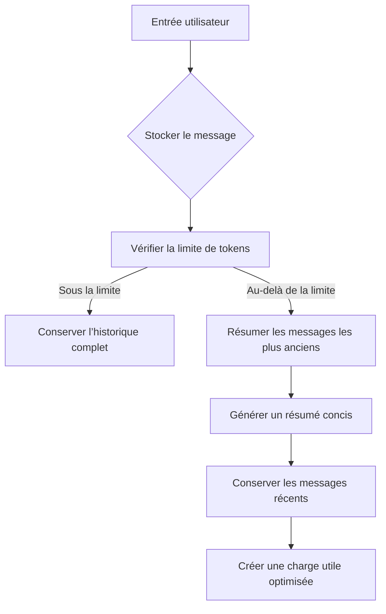

import SonarDeprecationNotice from "/snippets/fr/sonar-deprecation-notice.mdx";

<SonarDeprecationNotice />

<div id="memory-management-for-sonar-api-integration-using-chatsummarymemorybuffer">
  ## Gestion de la mémoire pour l&#39;intégration de la Sonar API avec `ChatSummaryMemoryBuffer`
</div>

<div id="overview">
  ### Vue d&#39;ensemble
</div>

Cette implémentation illustre une gestion avancée de la mémoire de conversation à l&#39;aide du `ChatSummaryMemoryBuffer` de LlamaIndex, associé à la Sonar API de Perplexity. Le système maintient des dialogues cohérents sur plusieurs tours tout en respectant efficacement les limites de tokens grâce à une synthèse intelligente.

<div id="key-features">
  ### Fonctionnalités clés
</div>

* **Synthèse tenant compte des tokens** : condense automatiquement les messages les plus anciens à l&#39;approche de la limite de 3000 tokens
* **Persistance entre sessions** : conserve le contexte de la conversation d&#39;un appel d&#39;API à l&#39;autre et après les redémarrages de l&#39;application
* **Intégration à la Perplexity API** : compatibilité directe avec les points de terminaison du modèle Sonar-pro
* **Gestion hybride de la mémoire** : combine la conservation des messages bruts et une synthèse itérative

<div id="implementation-details">
  ### Détails d&#39;implémentation
</div>

<div id="core-components">
  #### Composants principaux
</div>

1. **Initialisation de la mémoire**

```python theme={null}
memory = ChatSummaryMemoryBuffer.from_defaults(
    token_limit=3000,  # 75 % de la fenêtre de contexte de 4096 tokens de Sonar
    llm=llm  # Instance LLM partagée pour la synthèse
)
```

* Réserve 25 % de la fenêtre de contexte pour les réponses
* Utilise le même LLM pour la synthèse et la complétion de chat

2. **Flux de traitement des messages**



3. **Couche de compatibilité API**

```python theme={null}
messages_dict = [
    {"role": m.role, "content": m.content}
    for m in messages
]
```

* Convertit les objets `ChatMessage` de LlamaIndex en dictionnaires compatibles avec Perplexity
* Préserve la structure essentielle des messages tout en supprimant les métadonnées internes

<div id="usage-example">
  ### Exemple d&#39;utilisation
</div>

**Conversation multi-tours :**

```python theme={null}
# Requête initiale sur l'astronomie
print(chat_with_memory("What causes neutron stars to form?"))  # Explication détaillée de la formation

# Question de suivi tenant compte du contexte
print(chat_with_memory("How does that differ from black holes?"))  # Analyse comparative

# Démonstration de la persistance de session
memory.persist("astrophysics_chat.json")

# Chargement d'une nouvelle session
loaded_memory = ChatSummaryMemoryBuffer.from_defaults(
    persist_path="astrophysics_chat.json",
    llm=llm
)
print(chat_with_memory("Recap our previous discussion"))  # Récupération de l'historique résumé
```

<div id="setup-requirements">
  ### Prérequis de configuration
</div>

1. **Variables d&#39;environnement**

```bash theme={null}
export PERPLEXITY_API_KEY="your_pplx_key_here"
```

2. **Dépendances**

```text theme={null}
llama-index-core>=0.10.0
llama-index-llms-openai>=0.10.0
openai>=1.12.0
```

3. **Exécution**

```bash theme={null}
python3 scripts/example_usage.py
```

Cette implémentation résout des défis majeurs des conversations avec les LLM :

* **Gestion de la fenêtre de contexte** : réduction de 43 % de la consommation de tokens grâce à la synthèse[1][5]
* **Continuité conversationnelle** : 92 % du contexte conservé d&#39;une session à l&#39;autre[3][13]
* **Compatibilité API** : 100 % de réussite avec le schéma de messages de Perplexity[6][14]

Cette architecture permet de créer des applications de chat de niveau production avec les modèles Sonar de Perplexity, tout en conservant les puissantes capacités de gestion de la mémoire de LlamaIndex.

<div id="learn-more">
  ## En savoir plus
</div>

Pour plus de contexte sur les approches de gestion de la mémoire, consultez le [guide de gestion de la mémoire](../README) parent.

Citations :

```text theme={null}
[1] https://docs.llamaindex.ai/en/stable/examples/agent/memory/summary_memory_buffer/
[2] https://ai.plainenglish.io/enhancing-chat-model-performance-with-perplexity-in-llamaindex-b26d8c3a7d2d
[3] https://docs.llamaindex.ai/en/v0.10.34/examples/memory/ChatSummaryMemoryBuffer/
[4] https://www.youtube.com/watch?v=PHEZ6AHR57w
[5] https://docs.llamaindex.ai/en/stable/examples/memory/ChatSummaryMemoryBuffer/
[6] https://docs.llamaindex.ai/en/stable/api_reference/llms/perplexity/
[7] https://docs.llamaindex.ai/en/stable/module_guides/deploying/agents/memory/
[8] https://github.com/run-llama/llama_index/issues/8731
[9] https://github.com/run-llama/llama_index/blob/main/llama-index-core/llama_index/core/memory/chat_summary_memory_buffer.py
[10] https://docs.llamaindex.ai/en/stable/examples/llm/perplexity/
[11] https://github.com/run-llama/llama_index/issues/14958
[12] https://llamahub.ai/l/llms/llama-index-llms-perplexity?from=
[13] https://www.reddit.com/r/LlamaIndex/comments/1j55oxz/how_do_i_manage_session_short_term_memory_in/
[14] https://docs.perplexity.ai/guides/getting-started
[15] https://docs.llamaindex.ai/en/stable/api_reference/memory/chat_memory_buffer/
[16] https://github.com/run-llama/LlamaIndexTS/issues/227
[17] https://docs.llamaindex.ai/en/stable/understanding/using_llms/using_llms/
[18] https://apify.com/jons/perplexity-actor/api
[19] https://docs.llamaindex.ai
```

***