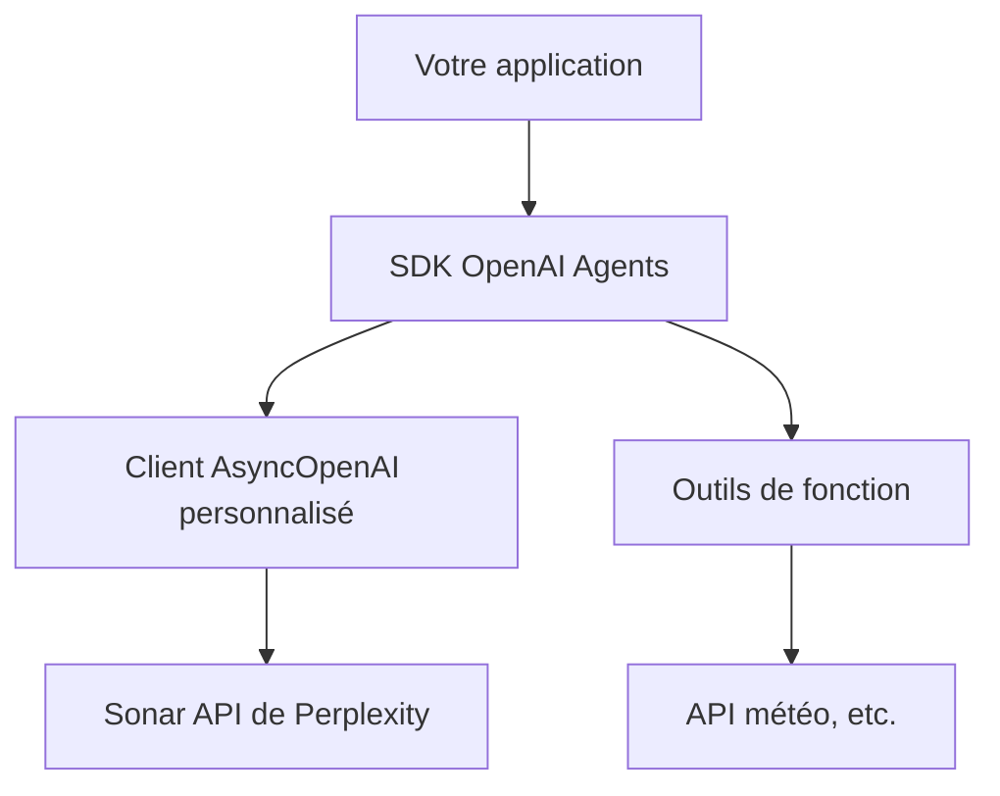

import SonarDeprecationNotice from "/snippets/fr/sonar-deprecation-notice.mdx";

<SonarDeprecationNotice />

<div id="what-youll-build">
  ## 🎯 Ce que vous allez créer
</div>

À l&#39;issue de ce guide, vous disposerez de :

* ✅ Un client OpenAI asynchrone personnalisé configuré pour Sonar API
* ✅ Un agent intelligent capable d&#39;appeler des fonctions
* ✅ Un exemple fonctionnel qui récupère des informations en temps réel
* ✅ Des schémas d&#39;intégration prêts pour la production

<div id="architecture-overview">
  ## 🏗️ Vue d&#39;ensemble de l&#39;architecture
</div>



Cette intégration vous permet de :

1. **Exploiter les capacités de recherche de Sonar** pour obtenir des réponses ancrées et en temps réel
2. **Utiliser le framework d&#39;agents d&#39;OpenAI** pour des interactions structurées et l&#39;appel de fonctions
3. **Combiner les deux** pour créer des applications puissantes et contextualisées

<div id="prerequisites">
  ## 📋 Prérequis
</div>

Avant de commencer, assurez-vous de disposer de :

* **Python 3.7+** installé
* **une clé API Perplexity** — [obtenez-en une ici](https://docs.perplexity.ai/home)
* **un accès au SDK OpenAI Agents** et une bonne maîtrise de celui-ci

<div id="installation">
  ## 🚀 Installation
</div>

Installez les dépendances requises :

```bash theme={null}
pip install openai nest-asyncio
```

:::info
Le paquet `nest-asyncio` est nécessaire pour exécuter du code asynchrone dans des environnements tels que les notebooks Jupyter, où une boucle d&#39;événements est déjà en cours d&#39;exécution.
:::

<div id="environment-setup">
  ## ⚙️ Configuration de l&#39;environnement
</div>

Configurez vos variables d&#39;environnement :

```bash theme={null}
# Requis : votre clé API Perplexity
export EXAMPLE_API_KEY="your-perplexity-api-key"

# Facultatif : personnalisez le point de terminaison de l'API (par défaut, le point de terminaison officiel)
export EXAMPLE_BASE_URL="https://api.perplexity.ai"

# Facultatif : choisissez votre modèle (par défaut, sonar-pro)
export EXAMPLE_MODEL_NAME="sonar-pro"
```

<div id="complete-implementation">
  ## 💻 Implémentation complète
</div>

Voici l&#39;implémentation complète, accompagnée d&#39;explications détaillées :

```python theme={null}
# Importer les bibliothèques standard nécessaires
import asyncio  # Pour exécuter du code asynchrone
import os       # Pour accéder aux variables d'environnement

# Importer AsyncOpenAI afin de créer un client asynchrone
from openai import AsyncOpenAI

# Importer les classes et fonctions personnalisées du paquet agents.
# Elles gèrent la création des agents, l'interface avec le modèle, l'exécution des agents, etc.
from agents import Agent, OpenAIChatCompletionsModel, Runner, function_tool, set_tracing_disabled

# Récupérer la configuration depuis les variables d'environnement ou utiliser les valeurs par défaut
BASE_URL = os.getenv("EXAMPLE_BASE_URL") or "https://api.perplexity.ai"
API_KEY = os.getenv("EXAMPLE_API_KEY") 
MODEL_NAME = os.getenv("EXAMPLE_MODEL_NAME") or "sonar-pro"

# Vérifier que toutes les variables de configuration requises sont définies
if not BASE_URL or not API_KEY or not MODEL_NAME:
    raise ValueError(
        "Please set EXAMPLE_BASE_URL, EXAMPLE_API_KEY, EXAMPLE_MODEL_NAME via env var or code."
    )

# Initialiser le client asynchrone OpenAI personnalisé avec les BASE_URL et API_KEY spécifiés.
client = AsyncOpenAI(base_url=BASE_URL, api_key=API_KEY)

# Désactiver le traçage pour éviter d'utiliser une clé de traçage de plateforme ; à ajuster selon vos besoins.
set_tracing_disabled(disabled=True)

# Définir un outil de type fonction que l'agent peut appeler.
# Le décorateur enregistre cette fonction comme outil dans le framework agents.
@function_tool
def get_weather(city: str):
    """
    Simulate fetching weather data for a given city.
    
    Args:
        city (str): The name of the city to retrieve weather for.
        
    Returns:
        str: A message with weather information.
    """
    print(f"[debug] getting weather for {city}")
    return f"The weather in {city} is sunny."

# Importer nest_asyncio pour prendre en charge les boucles d'événements imbriquées
import nest_asyncio

# Appliquer le correctif nest_asyncio pour permettre l'exécution d'asyncio.run()
# même si une boucle d'événements est déjà en cours.
nest_asyncio.apply()

async def main():
    """
    Main asynchronous function to set up and run the agent.
    
    This function creates an Agent with a custom model and function tools,
    then runs a query to get the weather in Tokyo.
    """
    # Créer une instance d'Agent avec :
    # - Un nom ("Assistant")
    # - Des instructions personnalisées ("Be precise and concise.")
    # - Un modèle construit à partir d'OpenAIChatCompletionsModel avec notre client et le nom du modèle.
    # - Une liste d'outils ; ici, seul get_weather est fourni.
    agent = Agent(
        name="Assistant",
        instructions="Be precise and concise.",
        model=OpenAIChatCompletionsModel(model=MODEL_NAME, openai_client=client),
        tools=[get_weather],
    )

    # Exécuter l'agent avec la requête d'exemple.
    result = await Runner.run(agent, "What's the weather in Tokyo?")
    
    # Afficher la sortie finale de l'agent.
    print(result.final_output)

# Code standard pour exécuter la fonction asynchrone main().
if __name__ == "__main__":
    asyncio.run(main())
```

<div id="code-breakdown">
  ## 🔍 Décomposition du code
</div>

Examinons les éléments clés :

<div id="1-client-configuration">
  ### 1. **Configuration du client**
</div>

```python theme={null}
client = AsyncOpenAI(base_url=BASE_URL, api_key=API_KEY)
```

Cela crée un client OpenAI asynchrone pointant vers la Sonar API de Perplexity. Le client gère l&#39;ensemble des communications HTTP et reste compatible avec l&#39;interface d&#39;OpenAI.

<div id="2-function-tools">
  ### 2. **Outils de fonction**
</div>

```python theme={null}
@function_tool
def get_weather(city: str):
    """Simulate fetching weather data for a given city."""
    return f"The weather in {city} is sunny."
```

Les outils de fonction permettent à votre agent d&#39;effectuer des actions qui vont au-delà de la génération de texte. En production, vous remplaceriez ceci par de véritables appels d&#39;API.

<div id="3-agent-creation">
  ### 3. **Création de l&#39;agent**
</div>

```python theme={null}
agent = Agent(
    name="Assistant",
    instructions="Be precise and concise.",
    model=OpenAIChatCompletionsModel(model=MODEL_NAME, openai_client=client),
    tools=[get_weather],
)
```

L&#39;agent associe les capacités linguistiques de Sonar à vos propres outils et instructions.

<div id="running-the-example">
  ## 🏃‍♂️ Exécution de l&#39;exemple
</div>

1. **Définissez vos variables d&#39;environnement** :
   ```bash theme={null}
   export EXAMPLE_API_KEY="your-perplexity-api-key"
   ```

2. **Enregistrez le code** dans un fichier (par exemple `pplx_openai_agent.py`)

3. **Lancez le script** :
   ```bash theme={null}
   python pplx_openai_agent.py
   ```

**Résultat attendu** :

```
[debug] getting weather for Tokyo
The weather in Tokyo is sunny.
```

<div id="customization-options">
  ## 🔧 Options de personnalisation
</div>

<div id="different-sonar-models">
  ### **Les différents modèles Sonar**
</div>

Choisissez le modèle adapté à votre cas d&#39;usage :

```python theme={null}
# Pour des requêtes rapides et légères
MODEL_NAME = "sonar"

# Pour des recherches et analyses complexes (par défaut)
MODEL_NAME = "sonar-pro"

# Pour les tâches de raisonnement approfondi
MODEL_NAME = "sonar-reasoning-pro"
```

<div id="custom-instructions">
  ### **Instructions personnalisées**
</div>

Adaptez le comportement de l&#39;agent :

```python theme={null}
agent = Agent(
    name="Research Assistant",
    instructions="""
    You are a research assistant specializing in academic literature.
    Always provide citations and verify information through multiple sources.
    Be thorough but concise in your responses.
    """,
    model=OpenAIChatCompletionsModel(model=MODEL_NAME, openai_client=client),
    tools=[search_papers, get_citations],
)
```

<div id="multiple-function-tools">
  ### **Plusieurs outils de fonction**
</div>

Ajoutez d&#39;autres fonctionnalités :

```python theme={null}
@function_tool
def search_web(query: str):
    """Search the web for current information."""
    # Implémentation ici
    pass

@function_tool
def analyze_data(data: str):
    """Analyze structured data."""
    # Implémentation ici
    pass

agent = Agent(
    name="Multi-Tool Assistant",
    instructions="Use the appropriate tool for each task.",
    model=OpenAIChatCompletionsModel(model=MODEL_NAME, openai_client=client),
    tools=[get_weather, search_web, analyze_data],
)
```

<div id="production-considerations">
  ## 🚀 Considérations pour la production
</div>

<div id="error-handling">
  ### **Gestion des erreurs**
</div>

```python theme={null}
async def robust_main():
    try:
        agent = Agent(
            name="Assistant",
            instructions="Be helpful and accurate.",
            model=OpenAIChatCompletionsModel(model=MODEL_NAME, openai_client=client),
            tools=[get_weather],
        )
        
        result = await Runner.run(agent, "What's the weather in Tokyo?")
        return result.final_output
        
    except Exception as e:
        print(f"Error running agent: {e}")
        return "Sorry, I encountered an error processing your request."
```

<div id="rate-limiting">
  ### **Limitation du débit de requêtes**
</div>

```python theme={null}
import aiohttp
from openai import AsyncOpenAI

# Configurer le client avec des délais d'expiration et des nouvelles tentatives personnalisés
client = AsyncOpenAI(
    base_url=BASE_URL, 
    api_key=API_KEY,
    timeout=30.0,
    max_retries=3
)
```

<div id="logging-and-monitoring">
  ### **Journalisation et surveillance**
</div>

```python theme={null}
import logging

logging.basicConfig(level=logging.INFO)
logger = logging.getLogger(__name__)

@function_tool
def get_weather(city: str):
    logger.info(f"Fetching weather for {city}")
    # Implémentation ici
```

<div id="advanced-integration-patterns">
  ## 🔗 Schémas d&#39;intégration avancés
</div>

<div id="streaming-responses">
  ### **Réponses en streaming**
</div>

Pour les applications en temps réel :

```python theme={null}
async def stream_agent_response(query: str):
    agent = Agent(
        name="Streaming Assistant",
        instructions="Provide detailed, step-by-step responses.",
        model=OpenAIChatCompletionsModel(model=MODEL_NAME, openai_client=client),
        tools=[get_weather],
    )
    
    async for chunk in Runner.stream(agent, query):
        print(chunk, end='', flush=True)
```

<div id="context-management">
  ### **Gestion du contexte**
</div>

Pour les conversations multi-tours :

```python theme={null}
class ConversationManager:
    def __init__(self):
        self.agent = Agent(
            name="Conversational Assistant",
            instructions="Maintain context across multiple interactions.",
            model=OpenAIChatCompletionsModel(model=MODEL_NAME, openai_client=client),
            tools=[get_weather],
        )
        self.conversation_history = []
    
    async def chat(self, message: str):
        result = await Runner.run(self.agent, message)
        self.conversation_history.append({"user": message, "assistant": result.final_output})
        return result.final_output
```

<div id="important-notes">
  ## ⚠️ Remarques importantes
</div>

* **Coûts d&#39;API** : surveillez votre consommation, car Perplexity comme OpenAI Agents peuvent générer des coûts
* **Limites de débit** : respectez les limites de débit de l&#39;API et mettez en place des stratégies de backoff adaptées
* **Gestion des erreurs** : implémentez toujours une gestion des erreurs robuste pour les applications en production
* **Sécurité** : conservez vos clés d&#39;API en lieu sûr et ne les committez jamais dans un système de gestion de versions

<div id="use-cases">
  ## 🎯 Cas d&#39;usage
</div>

Ce schéma d&#39;intégration est idéal pour :

* **🔍 Assistants de recherche** — Associer la recherche en temps réel à des réponses structurées
* **📊 Outils d&#39;analyse de données** — Utiliser Sonar pour le contexte et les agents pour le traitement
* **🤖 Support client** — Des réponses ancrées, avec appel de fonctions à l&#39;appui
* **📚 Applications éducatives** — Des informations en temps réel assorties de fonctionnalités interactives

<div id="references">
  ## 📚 Références
</div>

* [Documentation de la Sonar API de Perplexity](https://docs.perplexity.ai/home)
* [Documentation du SDK OpenAI Agents](https://github.com/openai/openai-agents-python)
* [Référence du client AsyncOpenAI](https://platform.openai.com/docs/api-reference)
* [Bonnes pratiques d&#39;appel de fonctions](https://platform.openai.com/docs/guides/function-calling)

***

**Prêt à vous lancer ?** Cette intégration ouvre de vastes possibilités pour créer des agents intelligents et ancrés dans des sources fiables. Commencez par l&#39;exemple de base, puis ajoutez progressivement des outils et des fonctionnalités plus avancés ! 🚀