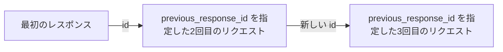

フォローアップのリクエストが以前のターンを踏まえて応答できるのは、それらを渡した場合のみです。方法は2つあり、自分で再送するか、`previous_response_id` で完了済みの以前のレスポンスを指定します。`previous_response_id` はよくあるケースのためのショートカットで、新しいリクエストを完了済みの以前のレスポンスに紐づけるため、会話を自分で再送する必要がありません。

<div id="replay-conversation-turns-yourself">
  ## 会話ターンを自分で再送する
</div>

次のターンを、これまでのターンを含む `input` 配列として送信します。各ターンは `type: "message"` と `role` (`user` または `assistant`) を持つメッセージ項目です。新しい質問は末尾に追加します。

<CodeGroup>
  ```python Python theme={null}
  from perplexity import Perplexity

  client = Perplexity()

  first = client.responses.create(
      model="openai/gpt-5.6-sol",
      input="My favorite programming language is Rust.",
  )
  print(first.output_text)

  # これまでの会話を再送し、続きの質問を追加する。
  second = client.responses.create(
      model="openai/gpt-5.6-sol",
      input=[
          {"type": "message", "role": "user", "content": "My favorite programming language is Rust."},
          {"type": "message", "role": "assistant", "content": first.output_text},
          {"type": "message", "role": "user", "content": "What's a good beginner project to practice it?"},
      ],
  )
  print(second.output_text)
  ```

  ```typescript TypeScript theme={null}
  import Perplexity from '@perplexity-ai/perplexity_ai';

  const client = new Perplexity();

  const first = await client.responses.create({
    model: 'openai/gpt-5.6-sol',
    input: 'My favorite programming language is Rust.',
  });
  console.log(first.output_text);

  const second = await client.responses.create({
    model: 'openai/gpt-5.6-sol',
    input: [
      { type: 'message', role: 'user', content: 'My favorite programming language is Rust.' },
      { type: 'message', role: 'assistant', content: first.output_text ?? '' },
      { type: 'message', role: 'user', content: "What's a good beginner project to practice it?" },
    ],
  });
  console.log(second.output_text);
  ```

  ```bash cURL theme={null}
  FIRST=$(curl -s https://api.perplexity.ai/v1/agent \
    -H "Authorization: Bearer $PERPLEXITY_API_KEY" \
    -H "Content-Type: application/json" \
    -d '{
      "model": "openai/gpt-5.6-sol",
      "input": "My favorite programming language is Rust."
    }')
  FIRST_TEXT=$(echo "$FIRST" | jq -r '.output[] | select(.type == "message") | .content[0].text')

  # これまでの会話を再送し、続きの質問を追加する。
  curl https://api.perplexity.ai/v1/agent \
    -H "Authorization: Bearer $PERPLEXITY_API_KEY" \
    -H "Content-Type: application/json" \
    -d "$(jq -n --arg text "$FIRST_TEXT" '{
      model: "openai/gpt-5.6-sol",
      input: [
        { type: "message", role: "user", content: "My favorite programming language is Rust." },
        { type: "message", role: "assistant", content: $text },
        { type: "message", role: "user", content: "What'\''s a good beginner project to practice it?" }
      ]
    }')" | jq
  ```
</CodeGroup>

この方法なら、送信するコンテキストの内容を完全に制御できます。続きの質問を送る前に、それまでのターンを要約する、伏せる、並べ替える、削除するといった操作が可能です。ただし、その代わりに会話の保持は自分で行い、呼び出しごとに毎回送り直す必要があります。

<div id="resume-from-a-prior-response">
  ## 以前のレスポンスから再開する
</div>

会話全体を再送信する代わりに、完了済みの以前のレスポンスを次のリクエストで指定し、新しいターンだけを送信できます。

<Info>
  Agent API はレスポンスと会話状態をサーバー側で保持するため、レスポンスの取得 (`store`) や継続 (`previous_response_id`) が可能です。`store: false` を設定しても、そのレスポンスが取得対象から除外されるだけで、永続化が無効になるわけではありません。そのレスポンスは引き続き継続元として利用できます。Perplexity とゼロデータ保持 (ZDR) 契約を結んでいるアカウントの場合は、ステートフルな機能を利用する前にアカウントチームへご確認ください。お問い合わせ先は [api@perplexity.ai](mailto:api@perplexity.ai) です。
</Info>

1. 最初のレスポンスを作成し、その `id` を保持します。
2. その `id` を `previous_response_id` に設定してフォローアップを送信します。
3. `input` には新しいユーザーターンのみを含めます。

<CodeGroup>
  ```python Python theme={null}
  from perplexity import Perplexity

  client = Perplexity()

  first = client.responses.create(
      model="openai/gpt-5.6-sol",
      input="My favorite programming language is Rust.",
      store=True,
  )
  print(first.id)

  follow_up = client.responses.create(
      model="openai/gpt-5.6-sol",
      previous_response_id=first.id,
      input="What's my favorite programming language?",
  )
  print(follow_up.output_text)
  ```

  ```typescript Typescript theme={null}
  import Perplexity from '@perplexity-ai/perplexity_ai';

  const client = new Perplexity();

  const first = await client.responses.create({
    model: 'openai/gpt-5.6-sol',
    input: 'My favorite programming language is Rust.',
    store: true,
  });
  console.log(first.id);

  const followUp = await client.responses.create({
    model: 'openai/gpt-5.6-sol',
    previous_response_id: first.id,
    input: "What's my favorite programming language?",
  });
  console.log(followUp.output_text);
  ```

  ```bash cURL theme={null}
  FIRST_ID=$(curl https://api.perplexity.ai/v1/agent \
    -H "Authorization: Bearer $PERPLEXITY_API_KEY" \
    -H "Content-Type: application/json" \
    -d '{
      "model": "openai/gpt-5.6-sol",
      "input": "My favorite programming language is Rust.",
      "store": true
    }' | jq -r '.id')

  curl https://api.perplexity.ai/v1/agent \
    -H "Authorization: Bearer $PERPLEXITY_API_KEY" \
    -H "Content-Type: application/json" \
    -d "{
      \"model\": \"openai/gpt-5.6-sol\",
      \"previous_response_id\": \"$FIRST_ID\",
      \"input\": \"What's my favorite programming language?\"
    }" | jq
  ```
</CodeGroup>

<div id="how-continuity-works">
  ### 継続の仕組み
</div>

新しいリクエストは、以前のレスポンスで保存された会話状態を引き継いで続行されます。この状態には過去のチェーンが含まれているため、それ以前のターンをすべて手動で再送することなく、マルチターンスレッド内の最新のレスポンスから会話を継続できます。



これは、次のターンで以前のユーザーメッセージやアシスタントメッセージを踏まえてレスポンスを組み立てたい、会話形式のフォローアップに使用します。新しいレスポンスに適用したい指示、ツール、model の設定があれば、引き続き送信してください。

<div id="retrieve-a-response">
  ### レスポンスを取得する
</div>

完了したレスポンスは、後から `id` を指定して取得できます。これは新しいターンを開始するものではなく、元のレスポンスの JSON スナップショットを返します。

<CodeGroup>
  ```python Python theme={null}
  from perplexity import Perplexity

  client = Perplexity()

  first = client.responses.create(
      model="openai/gpt-5.6-sol",
      input="My favorite programming language is Rust.",
  )

  response = client.responses.retrieve(first.id)
  print(response.status)
  for item in response.output:
      if item.type == "message":
          print(item.content[0].text)
  ```

  ```typescript Typescript theme={null}
  import Perplexity from '@perplexity-ai/perplexity_ai';

  const client = new Perplexity();

  const first = await client.responses.create({
    model: 'openai/gpt-5.6-sol',
    input: 'My favorite programming language is Rust.',
  });

  const response = await client.responses.retrieve(first.id);
  console.log(response.status);
  for (const item of response.output) {
    if (item.type === 'message') {
      console.log(item.content[0].text);
    }
  }
  ```

  ```bash cURL theme={null}
  FIRST_ID=$(curl https://api.perplexity.ai/v1/agent \
    -H "Authorization: Bearer $PERPLEXITY_API_KEY" \
    -H "Content-Type: application/json" \
    -d '{
      "model": "openai/gpt-5.6-sol",
      "input": "My favorite programming language is Rust."
    }' | jq -r '.id') && curl https://api.perplexity.ai/v1/agent/$FIRST_ID \
    -H "Authorization: Bearer $PERPLEXITY_API_KEY" | jq
  ```
</CodeGroup>

取得できるのは、`store` を省略、または `true` を指定して作成したレスポンスのみです。`store: false` のレスポンスは、取得時に `404` が返ります。確実に取得できる必要があるレスポンスは、`background: true` を指定して作成してください。

<div id="storage-behavior">
  ### ストレージの挙動
</div>

`store` は、そのレスポンスをユーザー向けの取得手段から参照できるかどうかを制御します。そのレスポンスを `previous_response_id` による継続元として使用することを妨げるものではありません。

| 設定           | 挙動                                                          |
| ------------ | ----------------------------------------------------------- |
| 省略または `true` | レスポンスを後から取得でき、`previous_response_id` としても使用できます。            |
| `false`      | レスポンスはユーザー向けの取得からは隠されますが、`previous_response_id` としては使用できます。 |

レスポンスを取得手段経由で公開したくないものの、アプリケーションのフロー内で次のリクエストをそこから継続させたい場合は `store: false` を使用してください。たとえば、`store: false` のレスポンスを取得しようとすると `404` が返りますが、`previous_response_id` による継続は引き続き可能です。

<CodeGroup>
  ```python Python theme={null}
  from perplexity import Perplexity

  client = Perplexity()

  hidden = client.responses.create(
      model="openai/gpt-5.6-sol",
      input="My favorite programming language is Rust.",
      store=False,
  )

  try:
      client.responses.retrieve(hidden.id)
  except Exception as e:
      print(e)  # 404 NotFoundError

  follow_up = client.responses.create(
      model="openai/gpt-5.6-sol",
      previous_response_id=hidden.id,  # 引き続き動作する
      input="What's my favorite programming language?",
  )
  print(follow_up.output_text)
  ```

  ```typescript Typescript theme={null}
  import Perplexity from '@perplexity-ai/perplexity_ai';

  const client = new Perplexity();

  const hidden = await client.responses.create({
    model: 'openai/gpt-5.6-sol',
    input: 'My favorite programming language is Rust.',
    store: false,
  });

  try {
    await client.responses.retrieve(hidden.id);
  } catch (e) {
    console.log(e); // 404 NotFoundError
  }

  const followUp = await client.responses.create({
    model: 'openai/gpt-5.6-sol',
    previous_response_id: hidden.id, // 引き続き動作する
    input: "What's my favorite programming language?",
  });
  console.log(followUp.output_text);
  ```

  ```bash cURL theme={null}
  HIDDEN_ID=$(curl https://api.perplexity.ai/v1/agent \
    -H "Authorization: Bearer $PERPLEXITY_API_KEY" \
    -H "Content-Type: application/json" \
    -d '{
      "model": "openai/gpt-5.6-sol",
      "input": "My favorite programming language is Rust.",
      "store": false
    }' | jq -r '.id')

  curl https://api.perplexity.ai/v1/agent/$HIDDEN_ID \
    -H "Authorization: Bearer $PERPLEXITY_API_KEY"
  # -> 404 {"error":{"message":"resource not found", ...}}

  curl https://api.perplexity.ai/v1/agent \
    -H "Authorization: Bearer $PERPLEXITY_API_KEY" \
    -H "Content-Type: application/json" \
    -d "{
      \"model\": \"openai/gpt-5.6-sol\",
      \"previous_response_id\": \"$HIDDEN_ID\",
      \"input\": \"What's my favorite programming language?\"
    }" | jq
  # -> 引き続き動作する
  ```
</CodeGroup>

<div id="requirements-and-errors">
  ### 要件とエラー
</div>

* `previous_response_id` には、同一アカウントの以前の Agent API レスポンスを指定する必要があります。
* 以前のレスポンスは完了済みである必要があります。まだ実行中の場合、失敗している場合、または id を解決できない場合、API は後続リクエストを開始せず `400` エラーを返します。
* まだ実行中のレスポンスから継続したい場合は、完了を待ってから同じ `previous_response_id` で再試行してください。

<div id="next-steps">
  ## 次のステップ
</div>

<CardGroup cols={2}>
  <Card title="画像の添付" icon="eye" href="/ja/docs/agent-api/image-attachments">
    リクエストに画像を添付します。
  </Card>

  <Card title="出力の制御" icon="sliders" href="/ja/docs/agent-api/output-control">
    ストリーミング、バックグラウンド実行、エラー処理、構造化出力を制御します。
  </Card>
</CardGroup>