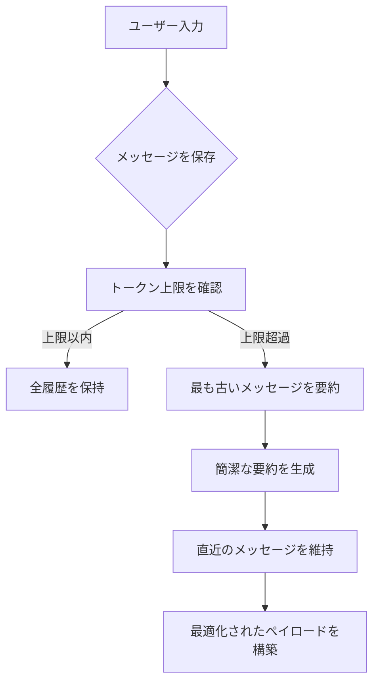

import SonarDeprecationNotice from "/snippets/ja/sonar-deprecation-notice.mdx";

<SonarDeprecationNotice />

<div id="memory-management-for-sonar-api-integration-using-chatsummarymemorybuffer">
  ## `ChatSummaryMemoryBuffer` を使用した Sonar API 統合におけるメモリ管理
</div>

<div id="overview">
  ### 概要
</div>

この実装では、LlamaIndex の `ChatSummaryMemoryBuffer` と Perplexity の Sonar API を組み合わせた高度な会話メモリ管理を紹介します。インテリジェントな要約により トークン の上限に効率よく対処しながら、一貫性のあるマルチターン対話を維持できます。

<div id="key-features">
  ### 主な機能
</div>

* **トークン数を考慮した要約**: 3000 トークンの上限に近づくと、古いメッセージを自動的に要約して圧縮します
* **セッションをまたぐ永続化**: API 呼び出し間やアプリケーションの再起動をまたいで会話のコンテキストを保持します
* **Perplexity API との統合**: Sonar-pro モデルのエンドポイントとそのまま互換性があります
* **ハイブリッドなメモリ管理**: メッセージをそのまま保持する方式と、反復的な要約を組み合わせます

<div id="implementation-details">
  ### 実装の詳細
</div>

<div id="core-components">
  #### 主要コンポーネント
</div>

1. **メモリの初期化**

```python theme={null}
memory = ChatSummaryMemoryBuffer.from_defaults(
    token_limit=3000,  # Sonar の 4096 トークンのコンテキストウィンドウの 75%
    llm=llm  # 要約に共用する LLM インスタンス
)
```

* コンテキストウィンドウの25%を応答用に確保
* 要約とチャット補完に同じLLMを使用

2. **メッセージ処理フロー**



3. **API互換レイヤー**

```python theme={null}
messages_dict = [
    {"role": m.role, "content": m.content}
    for m in messages
]
```

* LlamaIndex の `ChatMessage` オブジェクトを Perplexity 互換の辞書に変換します
* 内部メタデータを除去しつつ、メッセージの基本構造を保持します

<div id="usage-example">
  ### 使用例
</div>

**マルチターン会話:**

```python theme={null}
# 天文学に関する最初の質問
print(chat_with_memory("What causes neutron stars to form?"))  # 形成過程の詳細な説明

# 文脈を踏まえた追加質問
print(chat_with_memory("How does that differ from black holes?"))  # 比較分析

# セッション永続化のデモ
memory.persist("astrophysics_chat.json")

# 新しいセッションでの読み込み
loaded_memory = ChatSummaryMemoryBuffer.from_defaults(
    persist_path="astrophysics_chat.json",
    llm=llm
)
print(chat_with_memory("Recap our previous discussion"))  # 要約された履歴の取得
```

<div id="setup-requirements">
  ### セットアップ要件
</div>

1. **環境変数**

```bash theme={null}
export PERPLEXITY_API_KEY="your_pplx_key_here"
```

2. **依存関係**

```text theme={null}
llama-index-core>=0.10.0
llama-index-llms-openai>=0.10.0
openai>=1.12.0
```

3. **実行**

```bash theme={null}
python3 scripts/example_usage.py
```

この実装は、LLMの会話における主要な課題を解決します。

* **コンテキストウィンドウの管理**: 要約により トークン 使用量を43%削減[1][5]
* **会話の継続性**: セッションをまたいで92%のコンテキストを保持[3][13]
* **API互換性**: Perplexityのメッセージスキーマで100%の成功率[6][14]

このアーキテクチャにより、LlamaIndexの強力なメモリ管理機能を活かしつつ、PerplexityのSonar モデル を用いた本番品質のチャットアプリケーションを構築できます。

<div id="learn-more">
  ## 詳細情報
</div>

メモリ管理のアプローチについてさらに詳しくは、親ページの[メモリ管理ガイド](../README)を参照してください。

引用:

```text theme={null}
[1] https://docs.llamaindex.ai/en/stable/examples/agent/memory/summary_memory_buffer/
[2] https://ai.plainenglish.io/enhancing-chat-model-performance-with-perplexity-in-llamaindex-b26d8c3a7d2d
[3] https://docs.llamaindex.ai/en/v0.10.34/examples/memory/ChatSummaryMemoryBuffer/
[4] https://www.youtube.com/watch?v=PHEZ6AHR57w
[5] https://docs.llamaindex.ai/en/stable/examples/memory/ChatSummaryMemoryBuffer/
[6] https://docs.llamaindex.ai/en/stable/api_reference/llms/perplexity/
[7] https://docs.llamaindex.ai/en/stable/module_guides/deploying/agents/memory/
[8] https://github.com/run-llama/llama_index/issues/8731
[9] https://github.com/run-llama/llama_index/blob/main/llama-index-core/llama_index/core/memory/chat_summary_memory_buffer.py
[10] https://docs.llamaindex.ai/en/stable/examples/llm/perplexity/
[11] https://github.com/run-llama/llama_index/issues/14958
[12] https://llamahub.ai/l/llms/llama-index-llms-perplexity?from=
[13] https://www.reddit.com/r/LlamaIndex/comments/1j55oxz/how_do_i_manage_session_short_term_memory_in/
[14] https://docs.perplexity.ai/guides/getting-started
[15] https://docs.llamaindex.ai/en/stable/api_reference/memory/chat_memory_buffer/
[16] https://github.com/run-llama/LlamaIndexTS/issues/227
[17] https://docs.llamaindex.ai/en/stable/understanding/using_llms/using_llms/
[18] https://apify.com/jons/perplexity-actor/api
[19] https://docs.llamaindex.ai
```

***