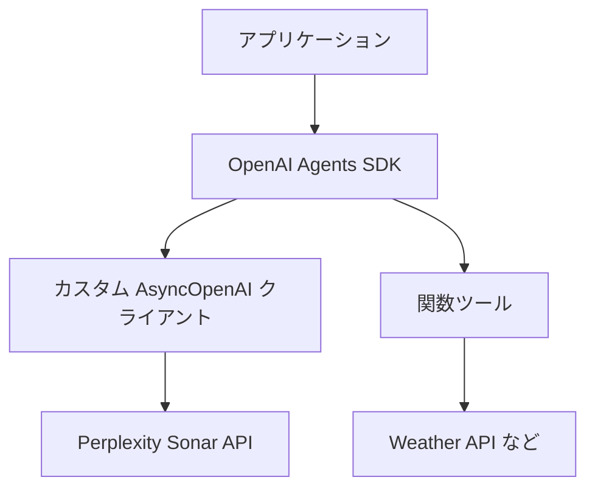

import SonarDeprecationNotice from "/snippets/ja/sonar-deprecation-notice.mdx";

<SonarDeprecationNotice />

<div id="what-youll-build">
  ## 🎯 構築するもの
</div>

このガイドを読み終える頃には、次のものが揃っています。

* ✅ Sonar API 向けに設定したカスタムの非同期 OpenAI クライアント
* ✅ 関数呼び出し (function calling) に対応したインテリジェントなエージェント
* ✅ リアルタイム情報を取得する実動作サンプル
* ✅ 本番運用に耐える統合パターン

<div id="architecture-overview">
  ## 🏗️ アーキテクチャ概要
</div>



この統合により、次のことが可能になります。

1. **Sonarの検索機能を活用**して、リアルタイムで根拠に基づく応答を得る
2. **OpenAIのエージェントフレームワークを使用**して、構造化されたやり取りや関数呼び出しを実現する
3. **両者を組み合わせ**、強力でコンテキストを理解するアプリケーションを構築する

<div id="prerequisites">
  ## 📋 前提条件
</div>

始める前に、以下を準備してください。

* **Python 3.7 以上** がインストールされていること
* **Perplexity API キー** - [こちらから取得](https://docs.perplexity.ai/home)
* **OpenAI Agents SDK** へのアクセス権と基本的な知識

<div id="installation">
  ## 🚀 インストール
</div>

必要な依存関係をインストールします。

```bash theme={null}
pip install openai nest-asyncio
```

:::info
Jupyter ノートブックなど、すでにイベントループが動作している環境で非同期コードを実行するには、`nest-asyncio` パッケージが必要です。
:::

<div id="environment-setup">
  ## ⚙️ 環境設定
</div>

環境変数を設定します。

```bash theme={null}
# 必須: Perplexity API キー
export EXAMPLE_API_KEY="your-perplexity-api-key"

# 任意: API エンドポイントの変更 (未指定の場合は公式エンドポイント)
export EXAMPLE_BASE_URL="https://api.perplexity.ai"

# 任意: 使用する モデル の指定 (未指定の場合は sonar-pro)
export EXAMPLE_MODEL_NAME="sonar-pro"
```

<div id="complete-implementation">
  ## 💻 完全な実装
</div>

以下に、詳細な解説を添えた完全な実装を示します。

```python theme={null}
# 必要な標準ライブラリをインポート
import asyncio  # 非同期コードの実行用
import os       # 環境変数へのアクセス用

# 非同期クライアントを作成するために AsyncOpenAI をインポート
from openai import AsyncOpenAI

# agents パッケージからカスタムクラスと関数をインポート。
# これらはエージェントの作成、モデルとの連携、エージェントの実行などを担う。
from agents import Agent, OpenAIChatCompletionsModel, Runner, function_tool, set_tracing_disabled

# 環境変数から設定を取得する（未設定の場合は既定値を使用）
BASE_URL = os.getenv("EXAMPLE_BASE_URL") or "https://api.perplexity.ai"
API_KEY = os.getenv("EXAMPLE_API_KEY") 
MODEL_NAME = os.getenv("EXAMPLE_MODEL_NAME") or "sonar-pro"

# 必要な設定変数がすべて設定されているかを検証する
if not BASE_URL or not API_KEY or not MODEL_NAME:
    raise ValueError(
        "Please set EXAMPLE_BASE_URL, EXAMPLE_API_KEY, EXAMPLE_MODEL_NAME via env var or code."
    )

# 指定した BASE_URL と API_KEY でカスタムの OpenAI 非同期クライアントを初期化する。
client = AsyncOpenAI(base_url=BASE_URL, api_key=API_KEY)

# プラットフォームのトレーシングキーを使わないよう、トレーシングを無効化する。必要に応じて調整すること。
set_tracing_disabled(disabled=True)

# エージェントが呼び出せる関数ツールを定義する。
# デコレーターにより、この関数が agents フレームワークのツールとして登録される。
@function_tool
def get_weather(city: str):
    """
    Simulate fetching weather data for a given city.
    
    Args:
        city (str): The name of the city to retrieve weather for.
        
    Returns:
        str: A message with weather information.
    """
    print(f"[debug] getting weather for {city}")
    return f"The weather in {city} is sunny."

# ネストしたイベントループに対応するため nest_asyncio をインポート
import nest_asyncio

# nest_asyncio のパッチを適用し、すでにイベントループが動作中でも
# asyncio.run() を実行できるようにする。
nest_asyncio.apply()

async def main():
    """
    Main asynchronous function to set up and run the agent.
    
    This function creates an Agent with a custom model and function tools,
    then runs a query to get the weather in Tokyo.
    """
    # 次の内容で Agent インスタンスを作成する:
    # - 名前（"Assistant"）
    # - カスタム指示（"Be precise and concise."）
    # - 作成したクライアントとモデル名を用いて OpenAIChatCompletionsModel から構築したモデル
    # - ツールのリスト。ここでは get_weather のみを指定。
    agent = Agent(
        name="Assistant",
        instructions="Be precise and concise.",
        model=OpenAIChatCompletionsModel(model=MODEL_NAME, openai_client=client),
        tools=[get_weather],
    )

    # サンプルのクエリでエージェントを実行する。
    result = await Runner.run(agent, "What's the weather in Tokyo?")
    
    # エージェントの最終出力を表示する。
    print(result.final_output)

# 非同期の main() 関数を実行するための定型コード。
if __name__ == "__main__":
    asyncio.run(main())
```

<div id="code-breakdown">
  ## 🔍 コードの解説
</div>

主要な構成要素を見ていきましょう。

<div id="1-client-configuration">
  ### 1. **クライアントの設定**
</div>

```python theme={null}
client = AsyncOpenAI(base_url=BASE_URL, api_key=API_KEY)
```

これにより、PerplexityのSonar APIを参照先とする非同期のOpenAIクライアントが作成されます。このクライアントはHTTP通信をすべて処理し、OpenAIのインターフェースとの互換性を維持します。

<div id="2-function-tools">
  ### 2. **関数ツール**
</div>

```python theme={null}
@function_tool
def get_weather(city: str):
    """Simulate fetching weather data for a given city."""
    return f"The weather in {city} is sunny."
```

関数ツールを使うと、エージェントはテキスト生成にとどまらないアクションを実行できます。本番環境では、この部分を実際のAPI呼び出しに置き換えてください。

<div id="3-agent-creation">
  ### 3. **エージェントの作成**
</div>

```python theme={null}
agent = Agent(
    name="Assistant",
    instructions="Be precise and concise.",
    model=OpenAIChatCompletionsModel(model=MODEL_NAME, openai_client=client),
    tools=[get_weather],
)
```

このエージェントは、Sonar の言語処理能力に、独自のツールと指示を組み合わせたものです。

<div id="running-the-example">
  ## 🏃‍♂️ サンプルの実行
</div>

1. **環境変数を設定します**：
   ```bash theme={null}
   export EXAMPLE_API_KEY="your-perplexity-api-key"
   ```

2. **コードをファイルに保存します** (例: `pplx_openai_agent.py`) 

3. **スクリプトを実行します**：
   ```bash theme={null}
   python pplx_openai_agent.py
   ```

**想定される出力**：

```
[debug] getting weather for Tokyo
The weather in Tokyo is sunny.
```

<div id="customization-options">
  ## 🔧 カスタマイズオプション
</div>

<div id="different-sonar-models">
  ### **さまざまな Sonar モデル**
</div>

ユースケースに適したモデルを選択してください。

```python theme={null}
# 高速・軽量なクエリ向け
MODEL_NAME = "sonar"

# 複雑な調査・分析向け（デフォルト）
MODEL_NAME = "sonar-pro"

# 高度な推論タスク向け
MODEL_NAME = "sonar-reasoning-pro"
```

<div id="custom-instructions">
  ### **カスタム指示**
</div>

エージェントの動作をカスタマイズします。

```python theme={null}
agent = Agent(
    name="Research Assistant",
    instructions="""
    You are a research assistant specializing in academic literature.
    Always provide citations and verify information through multiple sources.
    Be thorough but concise in your responses.
    """,
    model=OpenAIChatCompletionsModel(model=MODEL_NAME, openai_client=client),
    tools=[search_papers, get_citations],
)
```

<div id="multiple-function-tools">
  ### **複数の関数ツール**
</div>

さらに機能を追加します。

```python theme={null}
@function_tool
def search_web(query: str):
    """Search the web for current information."""
    # ここに実装を記述
    pass

@function_tool
def analyze_data(data: str):
    """Analyze structured data."""
    # ここに実装を記述
    pass

agent = Agent(
    name="Multi-Tool Assistant",
    instructions="Use the appropriate tool for each task.",
    model=OpenAIChatCompletionsModel(model=MODEL_NAME, openai_client=client),
    tools=[get_weather, search_web, analyze_data],
)
```

<div id="production-considerations">
  ## 🚀 本番環境での考慮事項
</div>

<div id="error-handling">
  ### **エラーハンドリング**
</div>

```python theme={null}
async def robust_main():
    try:
        agent = Agent(
            name="Assistant",
            instructions="Be helpful and accurate.",
            model=OpenAIChatCompletionsModel(model=MODEL_NAME, openai_client=client),
            tools=[get_weather],
        )
        
        result = await Runner.run(agent, "What's the weather in Tokyo?")
        return result.final_output
        
    except Exception as e:
        print(f"Error running agent: {e}")
        return "Sorry, I encountered an error processing your request."
```

<div id="rate-limiting">
  ### **レート制限**
</div>

```python theme={null}
import aiohttp
from openai import AsyncOpenAI

# タイムアウトとリトライをカスタム設定してクライアントを初期化
client = AsyncOpenAI(
    base_url=BASE_URL, 
    api_key=API_KEY,
    timeout=30.0,
    max_retries=3
)
```

<div id="logging-and-monitoring">
  ### **ロギングとモニタリング**
</div>

```python theme={null}
import logging

logging.basicConfig(level=logging.INFO)
logger = logging.getLogger(__name__)

@function_tool
def get_weather(city: str):
    logger.info(f"Fetching weather for {city}")
    # ここに実装を記述
```

<div id="advanced-integration-patterns">
  ## 🔗 高度な統合パターン
</div>

<div id="streaming-responses">
  ### **ストリーミングレスポンス**
</div>

リアルタイムアプリケーションの場合:

```python theme={null}
async def stream_agent_response(query: str):
    agent = Agent(
        name="Streaming Assistant",
        instructions="Provide detailed, step-by-step responses.",
        model=OpenAIChatCompletionsModel(model=MODEL_NAME, openai_client=client),
        tools=[get_weather],
    )
    
    async for chunk in Runner.stream(agent, query):
        print(chunk, end='', flush=True)
```

<div id="context-management">
  ### **コンテキスト管理**
</div>

マルチターン会話では次のようにします:

```python theme={null}
class ConversationManager:
    def __init__(self):
        self.agent = Agent(
            name="Conversational Assistant",
            instructions="Maintain context across multiple interactions.",
            model=OpenAIChatCompletionsModel(model=MODEL_NAME, openai_client=client),
            tools=[get_weather],
        )
        self.conversation_history = []
    
    async def chat(self, message: str):
        result = await Runner.run(self.agent, message)
        self.conversation_history.append({"user": message, "assistant": result.final_output})
        return result.final_output
```

<div id="important-notes">
  ## ⚠️ 重要な注意事項
</div>

* **APIコスト**: PerplexityとOpenAI Agentsの両方でコストが発生する可能性があるため、使用量を監視してください
* **レート制限**: APIのレート制限を守り、適切なバックオフ戦略を実装してください
* **エラーハンドリング**: 本番アプリケーションでは必ず堅牢なエラー処理を実装してください
* **セキュリティ**: API キーは安全に管理し、バージョン管理システムには絶対にコミットしないでください

<div id="use-cases">
  ## 🎯 ユースケース
</div>

この統合パターンは、次のような用途に最適です。

* **🔍 リサーチアシスタント** - リアルタイム検索と構造化されたレスポンスの組み合わせ
* **📊 データ分析ツール** - コンテキスト取得に Sonar、処理にエージェントを活用
* **🤖 カスタマーサポート** - 関数呼び出しに対応した、根拠に基づくレスポンス
* **📚 教育向けアプリケーション** - インタラクティブな機能とリアルタイム情報の融合

<div id="references">
  ## 📚 参考資料
</div>

* [Perplexity Sonar API ドキュメント](https://docs.perplexity.ai/home)
* [OpenAI Agents SDK ドキュメント](https://github.com/openai/openai-agents-python)
* [AsyncOpenAI クライアントリファレンス](https://platform.openai.com/docs/api-reference)
* [関数呼び出しのベストプラクティス](https://platform.openai.com/docs/guides/function-calling)

***

**さっそく始めましょう。** この統合により、根拠に基づいたインテリジェントなエージェントを構築する道が大きく広がります。まずは基本的なサンプルから始め、より高度なツールや機能を少しずつ追加していきましょう！🚀