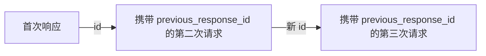

后续请求只有在你主动提供先前轮次的情况下才能理解它们：要么自行重放这些轮次，要么用 `previous_response_id` 指向此前已完成的响应。`previous_response_id` 是常见场景下的便捷做法：它让新请求直接指向此前已完成的响应，这样你就不必自行重新发送整段对话。

<div id="replay-conversation-turns-yourself">
  ## 自行重放对话轮次
</div>

将下一轮请求的 `input` 设为一个包含此前各轮的数组来发送。每一轮都是一个消息项，带有 `type: "message"` 和 `role` (`user` 或 `assistant`) 。把新问题追加到末尾即可。

<CodeGroup>
  ```python Python theme={null}
  from perplexity import Perplexity

  client = Perplexity()

  first = client.responses.create(
      model="openai/gpt-5.6-sol",
      input="My favorite programming language is Rust.",
  )
  print(first.output_text)

  # 重放目前为止的对话，然后加上追问。
  second = client.responses.create(
      model="openai/gpt-5.6-sol",
      input=[
          {"type": "message", "role": "user", "content": "My favorite programming language is Rust."},
          {"type": "message", "role": "assistant", "content": first.output_text},
          {"type": "message", "role": "user", "content": "What's a good beginner project to practice it?"},
      ],
  )
  print(second.output_text)
  ```

  ```typescript TypeScript theme={null}
  import Perplexity from '@perplexity-ai/perplexity_ai';

  const client = new Perplexity();

  const first = await client.responses.create({
    model: 'openai/gpt-5.6-sol',
    input: 'My favorite programming language is Rust.',
  });
  console.log(first.output_text);

  const second = await client.responses.create({
    model: 'openai/gpt-5.6-sol',
    input: [
      { type: 'message', role: 'user', content: 'My favorite programming language is Rust.' },
      { type: 'message', role: 'assistant', content: first.output_text ?? '' },
      { type: 'message', role: 'user', content: "What's a good beginner project to practice it?" },
    ],
  });
  console.log(second.output_text);
  ```

  ```bash cURL theme={null}
  FIRST=$(curl -s https://api.perplexity.ai/v1/agent \
    -H "Authorization: Bearer $PERPLEXITY_API_KEY" \
    -H "Content-Type: application/json" \
    -d '{
      "model": "openai/gpt-5.6-sol",
      "input": "My favorite programming language is Rust."
    }')
  FIRST_TEXT=$(echo "$FIRST" | jq -r '.output[] | select(.type == "message") | .content[0].text')

  # 重放目前为止的对话，然后加上追问。
  curl https://api.perplexity.ai/v1/agent \
    -H "Authorization: Bearer $PERPLEXITY_API_KEY" \
    -H "Content-Type: application/json" \
    -d "$(jq -n --arg text "$FIRST_TEXT" '{
      model: "openai/gpt-5.6-sol",
      input: [
        { type: "message", role: "user", content: "My favorite programming language is Rust." },
        { type: "message", role: "assistant", content: $text },
        { type: "message", role: "user", content: "What'\''s a good beginner project to practice it?" }
      ]
    }')" | jq
  ```
</CodeGroup>

这样你就能精确掌控发送哪些上下文：在追问之前，可以对早先的轮次做摘要、脱敏、重新排序，或干脆丢弃。代价是对话得由你自己维护，并且每次调用都要重新发送一遍。

<div id="resume-from-a-prior-response">
  ## 从先前的响应继续
</div>

无需重新发送整个对话，只需将下一次请求指向某个已完成的先前响应，并只发送新的一轮内容。

<Info>
  Agent API 会在服务端持久化响应和对话状态，因此响应既可被检索 (`store`) ，也可被继续 (`previous_response_id`) 。设置 `store: false` 只是让响应无法被检索——并不会关闭持久化，该响应仍可作为续接来源。如果你的账户与 Perplexity 签有零数据保留 (ZDR) 协议，在使用有状态功能前请先与你的客户团队确认——可联系 [api@perplexity.ai](mailto:api@perplexity.ai)。
</Info>

1. 创建第一个响应并保留其 `id`。
2. 发送后续请求，将 `previous_response_id` 设为该 `id`。
3. 在 `input` 中只放入新的用户轮次内容。

<CodeGroup>
  ```python Python theme={null}
  from perplexity import Perplexity

  client = Perplexity()

  first = client.responses.create(
      model="openai/gpt-5.6-sol",
      input="My favorite programming language is Rust.",
      store=True,
  )
  print(first.id)

  follow_up = client.responses.create(
      model="openai/gpt-5.6-sol",
      previous_response_id=first.id,
      input="What's my favorite programming language?",
  )
  print(follow_up.output_text)
  ```

  ```typescript Typescript theme={null}
  import Perplexity from '@perplexity-ai/perplexity_ai';

  const client = new Perplexity();

  const first = await client.responses.create({
    model: 'openai/gpt-5.6-sol',
    input: 'My favorite programming language is Rust.',
    store: true,
  });
  console.log(first.id);

  const followUp = await client.responses.create({
    model: 'openai/gpt-5.6-sol',
    previous_response_id: first.id,
    input: "What's my favorite programming language?",
  });
  console.log(followUp.output_text);
  ```

  ```bash cURL theme={null}
  FIRST_ID=$(curl https://api.perplexity.ai/v1/agent \
    -H "Authorization: Bearer $PERPLEXITY_API_KEY" \
    -H "Content-Type: application/json" \
    -d '{
      "model": "openai/gpt-5.6-sol",
      "input": "My favorite programming language is Rust.",
      "store": true
    }' | jq -r '.id')

  curl https://api.perplexity.ai/v1/agent \
    -H "Authorization: Bearer $PERPLEXITY_API_KEY" \
    -H "Content-Type: application/json" \
    -d "{
      \"model\": \"openai/gpt-5.6-sol\",
      \"previous_response_id\": \"$FIRST_ID\",
      \"input\": \"What's my favorite programming language?\"
    }" | jq
  ```
</CodeGroup>

<div id="how-continuity-works">
  ### 连续性的工作原理
</div>

新请求会从上一次响应保存的对话状态继续。该状态包含此前的完整对话链，因此你可以直接从多轮对话中的最新响应继续，而无需手动重放之前的每一轮。



当后续对话需要在此前的用户消息和助手消息基础上继续展开时，可采用这种方式。若希望某些新指令、工具或 model 设置对新响应生效，仍需在请求中继续发送。

<div id="retrieve-a-response">
  ### 获取响应
</div>

稍后可通过 `id` 获取已完成的响应。此操作不会开启新一轮对话，而是返回原响应的 JSON 快照。

<CodeGroup>
  ```python Python theme={null}
  from perplexity import Perplexity

  client = Perplexity()

  first = client.responses.create(
      model="openai/gpt-5.6-sol",
      input="My favorite programming language is Rust.",
  )

  response = client.responses.retrieve(first.id)
  print(response.status)
  for item in response.output:
      if item.type == "message":
          print(item.content[0].text)
  ```

  ```typescript Typescript theme={null}
  import Perplexity from '@perplexity-ai/perplexity_ai';

  const client = new Perplexity();

  const first = await client.responses.create({
    model: 'openai/gpt-5.6-sol',
    input: 'My favorite programming language is Rust.',
  });

  const response = await client.responses.retrieve(first.id);
  console.log(response.status);
  for (const item of response.output) {
    if (item.type === 'message') {
      console.log(item.content[0].text);
    }
  }
  ```

  ```bash cURL theme={null}
  FIRST_ID=$(curl https://api.perplexity.ai/v1/agent \
    -H "Authorization: Bearer $PERPLEXITY_API_KEY" \
    -H "Content-Type: application/json" \
    -d '{
      "model": "openai/gpt-5.6-sol",
      "input": "My favorite programming language is Rust."
    }' | jq -r '.id') && curl https://api.perplexity.ai/v1/agent/$FIRST_ID \
    -H "Authorization: Bearer $PERPLEXITY_API_KEY" | jq
  ```
</CodeGroup>

只有创建时省略 `store` 或将其设为 `true` 的响应才支持获取；`store: false` 的响应在获取时会返回 `404`。如果希望某个响应能够被可靠地获取，请在创建时设置 `background: true`。

<div id="storage-behavior">
  ### 存储行为
</div>

`store` 控制响应是否可通过面向用户的检索接口获取，但并不影响该响应继续作为 `previous_response_id` 的续接来源。

| 设置         | 行为                                           |
| ---------- | -------------------------------------------- |
| 省略或 `true` | 该响应可在之后被检索，也可用作 `previous_response_id`。      |
| `false`    | 该响应对面向用户的检索不可见，但仍可用作 `previous_response_id`。 |

如果你不希望响应通过检索被暴露，但仍需要应用流程中的下一次请求以它为起点继续，请使用 `store: false`。例如，检索 `store: false` 的响应会返回 `404`，但你依然可以通过 `previous_response_id` 从它继续：

<CodeGroup>
  ```python Python theme={null}
  from perplexity import Perplexity

  client = Perplexity()

  hidden = client.responses.create(
      model="openai/gpt-5.6-sol",
      input="My favorite programming language is Rust.",
      store=False,
  )

  try:
      client.responses.retrieve(hidden.id)
  except Exception as e:
      print(e)  # 404 NotFoundError

  follow_up = client.responses.create(
      model="openai/gpt-5.6-sol",
      previous_response_id=hidden.id,  # 仍然有效
      input="What's my favorite programming language?",
  )
  print(follow_up.output_text)
  ```

  ```typescript Typescript theme={null}
  import Perplexity from '@perplexity-ai/perplexity_ai';

  const client = new Perplexity();

  const hidden = await client.responses.create({
    model: 'openai/gpt-5.6-sol',
    input: 'My favorite programming language is Rust.',
    store: false,
  });

  try {
    await client.responses.retrieve(hidden.id);
  } catch (e) {
    console.log(e); // 404 NotFoundError
  }

  const followUp = await client.responses.create({
    model: 'openai/gpt-5.6-sol',
    previous_response_id: hidden.id, // 仍然有效
    input: "What's my favorite programming language?",
  });
  console.log(followUp.output_text);
  ```

  ```bash cURL theme={null}
  HIDDEN_ID=$(curl https://api.perplexity.ai/v1/agent \
    -H "Authorization: Bearer $PERPLEXITY_API_KEY" \
    -H "Content-Type: application/json" \
    -d '{
      "model": "openai/gpt-5.6-sol",
      "input": "My favorite programming language is Rust.",
      "store": false
    }' | jq -r '.id')

  curl https://api.perplexity.ai/v1/agent/$HIDDEN_ID \
    -H "Authorization: Bearer $PERPLEXITY_API_KEY"
  # -> 404 {"error":{"message":"resource not found", ...}}

  curl https://api.perplexity.ai/v1/agent \
    -H "Authorization: Bearer $PERPLEXITY_API_KEY" \
    -H "Content-Type: application/json" \
    -d "{
      \"model\": \"openai/gpt-5.6-sol\",
      \"previous_response_id\": \"$HIDDEN_ID\",
      \"input\": \"What's my favorite programming language?\"
    }" | jq
  # -> 仍然有效
  ```
</CodeGroup>

<div id="requirements-and-errors">
  ### 要求与错误
</div>

* `previous_response_id` 必须引用同一账户下先前的 Agent API 响应。
* 先前的响应必须已完成。如果该响应仍在运行、已失败，或该 id 无法解析，API 将返回 `400` 错误，而不会发起有效的后续请求。
* 如果需要基于仍在运行的响应继续，请等待其完成后，使用相同的 `previous_response_id` 重试。

<div id="next-steps">
  ## 后续步骤
</div>

<CardGroup cols={2}>
  <Card title="图像附件" icon="eye" href="/zh/docs/agent-api/image-attachments">
    在请求中附加图像。
  </Card>

  <Card title="输出控制" icon="sliders" href="/zh/docs/agent-api/output-control">
    控制流式输出、后台运行、错误处理和结构化输出。
  </Card>
</CardGroup>