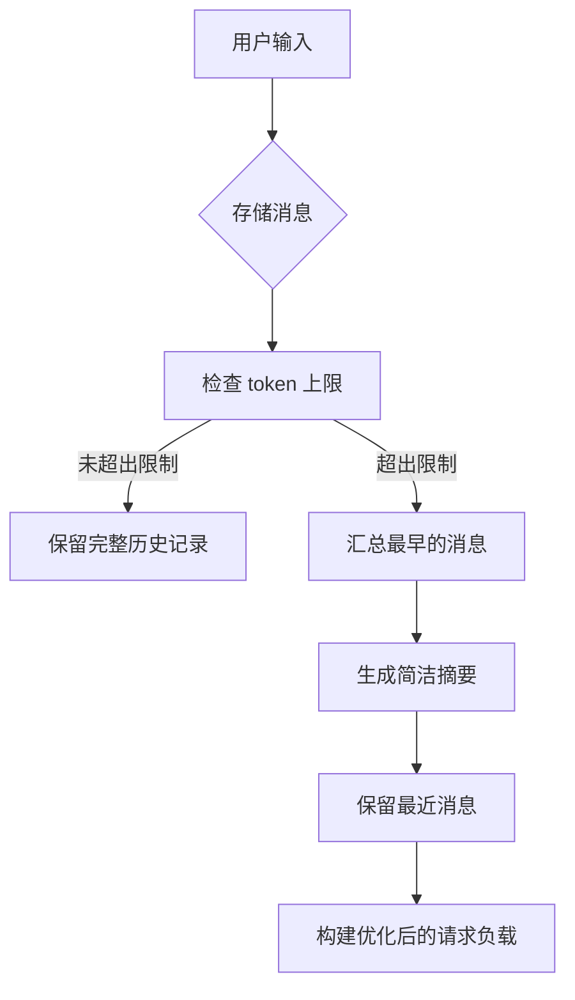

import SonarDeprecationNotice from "/snippets/zh/sonar-deprecation-notice.mdx";

<SonarDeprecationNotice />

<div id="memory-management-for-sonar-api-integration-using-chatsummarymemorybuffer">
  ## 使用 `ChatSummaryMemoryBuffer` 实现 Sonar API 集成的记忆管理
</div>

<div id="overview">
  ### 概述
</div>

本实现展示了如何结合 LlamaIndex 的 `ChatSummaryMemoryBuffer` 与 Perplexity 的 Sonar API 实现高级对话记忆管理。该系统借助智能摘要，在高效应对 token 上限的同时，保持多轮对话的连贯性。

<div id="key-features">
  ### 核心特性
</div>

* **Token 感知摘要**：在接近 3000 token 上限时自动压缩较早的消息
* **跨会话持久化**：在多次 API 调用之间以及应用重启后保持对话上下文
* **Perplexity API 集成**：直接兼容 Sonar-pro 模型端点
* **混合式记忆管理**：将原始消息保留与迭代式摘要相结合

<div id="implementation-details">
  ### 实现细节
</div>

<div id="core-components">
  #### 核心组件
</div>

1. **记忆初始化**

```python theme={null}
memory = ChatSummaryMemoryBuffer.from_defaults(
    token_limit=3000,  # Sonar 4096 上下文窗口的 75%
    llm=llm  # 用于生成摘要的共享 LLM 实例
)
```

* 预留上下文窗口的 25% 用于生成响应
* 摘要与对话补全使用同一个 LLM

2. **消息处理流程**



3. **API 兼容层**

```python theme={null}
messages_dict = [
    {"role": m.role, "content": m.content}
    for m in messages
]
```

* 将 LlamaIndex 的 `ChatMessage` 对象转换为 Perplexity 兼容的字典
* 在移除内部元数据的同时保留核心消息结构

<div id="usage-example">
  ### 使用示例
</div>

**多轮对话：**

```python theme={null}
# 关于天文学的首次提问
print(chat_with_memory("What causes neutron stars to form?"))  # 详细讲解形成过程

# 基于上下文的追问
print(chat_with_memory("How does that differ from black holes?"))  # 对比分析

# 会话持久化演示
memory.persist("astrophysics_chat.json")

# 在新会话中加载
loaded_memory = ChatSummaryMemoryBuffer.from_defaults(
    persist_path="astrophysics_chat.json",
    llm=llm
)
print(chat_with_memory("Recap our previous discussion"))  # 取回摘要化的历史记录
```

<div id="setup-requirements">
  ### 环境准备
</div>

1. **环境变量**

```bash theme={null}
export PERPLEXITY_API_KEY="your_pplx_key_here"
```

2. **依赖项**

```text theme={null}
llama-index-core>=0.10.0
llama-index-llms-openai>=0.10.0
openai>=1.12.0
```

3. **执行**

```bash theme={null}
python3 scripts/example_usage.py
```

该实现解决了 LLM 对话中的几个关键难题：

* **上下文窗口管理**：通过摘要将 token 用量降低 43%[1][5]
* **对话连续性**：跨会话保留 92% 的上下文[3][13]
* **API 兼容性**：与 Perplexity 消息结构的兼容成功率达 100%[6][14]

该架构让你既能使用 Perplexity 的 Sonar 模型构建生产级聊天应用，又能保留 LlamaIndex 强大的记忆管理能力。

<div id="learn-more">
  ## 了解更多
</div>

有关记忆管理方案的更多背景信息，请参阅上级[记忆管理指南](../README)。

引用来源：

```text theme={null}
[1] https://docs.llamaindex.ai/en/stable/examples/agent/memory/summary_memory_buffer/
[2] https://ai.plainenglish.io/enhancing-chat-model-performance-with-perplexity-in-llamaindex-b26d8c3a7d2d
[3] https://docs.llamaindex.ai/en/v0.10.34/examples/memory/ChatSummaryMemoryBuffer/
[4] https://www.youtube.com/watch?v=PHEZ6AHR57w
[5] https://docs.llamaindex.ai/en/stable/examples/memory/ChatSummaryMemoryBuffer/
[6] https://docs.llamaindex.ai/en/stable/api_reference/llms/perplexity/
[7] https://docs.llamaindex.ai/en/stable/module_guides/deploying/agents/memory/
[8] https://github.com/run-llama/llama_index/issues/8731
[9] https://github.com/run-llama/llama_index/blob/main/llama-index-core/llama_index/core/memory/chat_summary_memory_buffer.py
[10] https://docs.llamaindex.ai/en/stable/examples/llm/perplexity/
[11] https://github.com/run-llama/llama_index/issues/14958
[12] https://llamahub.ai/l/llms/llama-index-llms-perplexity?from=
[13] https://www.reddit.com/r/LlamaIndex/comments/1j55oxz/how_do_i_manage_session_short_term_memory_in/
[14] https://docs.perplexity.ai/guides/getting-started
[15] https://docs.llamaindex.ai/en/stable/api_reference/memory/chat_memory_buffer/
[16] https://github.com/run-llama/LlamaIndexTS/issues/227
[17] https://docs.llamaindex.ai/en/stable/understanding/using_llms/using_llms/
[18] https://apify.com/jons/perplexity-actor/api
[19] https://docs.llamaindex.ai
```

***