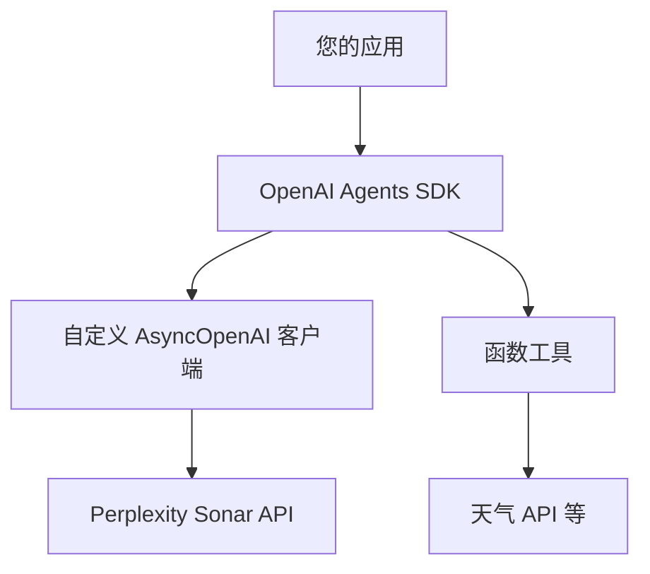

import SonarDeprecationNotice from "/snippets/zh/sonar-deprecation-notice.mdx";

<SonarDeprecationNotice />

<div id="what-youll-build">
  ## 🎯 你将构建什么
</div>

学完本指南后，你将拥有：

* ✅ 一个针对 Sonar API 配置的自定义异步 OpenAI 客户端
* ✅ 一个具备函数调用能力的智能体
* ✅ 一个能获取实时信息的可运行示例
* ✅ 可用于生产环境的集成模式

<div id="architecture-overview">
  ## 🏗️ 架构概览
</div>



此集成让你可以：

1. **利用 Sonar 的搜索能力**获得实时、有据可依的响应
2. **使用 OpenAI 的智能体框架**实现结构化交互与函数调用
3. **将两者结合**，构建强大且具备上下文感知能力的应用

<div id="prerequisites">
  ## 📋 前置条件
</div>

开始之前，请确保你已具备：

* 已安装 **Python 3.7+**
* **Perplexity API key** —— [点此获取](https://docs.perplexity.ai/home)
* 拥有 **OpenAI Agents SDK** 的访问权限并熟悉其使用

<div id="installation">
  ## 🚀 安装
</div>

安装所需依赖：

```bash theme={null}
pip install openai nest-asyncio
```

:::info
在 Jupyter Notebook 等已存在事件循环的环境中运行异步代码时，需要安装 `nest-asyncio` 包。
:::

<div id="environment-setup">
  ## ⚙️ 环境配置
</div>

配置环境变量：

```bash theme={null}
# 必填：你的 Perplexity API key
export EXAMPLE_API_KEY="your-perplexity-api-key"

# 可选：自定义 API 端点（默认使用官方端点）
export EXAMPLE_BASE_URL="https://api.perplexity.ai"

# 可选：选择所用的 模型（默认为 sonar-pro）
export EXAMPLE_MODEL_NAME="sonar-pro"
```

<div id="complete-implementation">
  ## 💻 完整实现
</div>

以下是完整实现及详细说明：

```python theme={null}
# 导入所需的标准库
import asyncio  # 用于运行异步代码
import os       # 用于访问环境变量

# 导入 AsyncOpenAI 以创建异步客户端
from openai import AsyncOpenAI

# 从 agents 包中导入自定义类和函数。
# 它们负责创建智能体、对接模型、运行智能体等工作。
from agents import Agent, OpenAIChatCompletionsModel, Runner, function_tool, set_tracing_disabled

# 从环境变量读取配置，若未设置则使用默认值
BASE_URL = os.getenv("EXAMPLE_BASE_URL") or "https://api.perplexity.ai"
API_KEY = os.getenv("EXAMPLE_API_KEY") 
MODEL_NAME = os.getenv("EXAMPLE_MODEL_NAME") or "sonar-pro"

# 校验所有必需的配置变量均已设置
if not BASE_URL or not API_KEY or not MODEL_NAME:
    raise ValueError(
        "Please set EXAMPLE_BASE_URL, EXAMPLE_API_KEY, EXAMPLE_MODEL_NAME via env var or code."
    )

# 使用指定的 BASE_URL 和 API_KEY 初始化自定义的 OpenAI 异步客户端。
client = AsyncOpenAI(base_url=BASE_URL, api_key=API_KEY)

# 禁用追踪，以免使用平台追踪密钥；可按需调整。
set_tracing_disabled(disabled=True)

# 定义一个可供智能体调用的函数工具。
# 该装饰器会把此函数注册为 agents 框架中的工具。
@function_tool
def get_weather(city: str):
    """
    Simulate fetching weather data for a given city.
    
    Args:
        city (str): The name of the city to retrieve weather for.
        
    Returns:
        str: A message with weather information.
    """
    print(f"[debug] getting weather for {city}")
    return f"The weather in {city} is sunny."

# 导入 nest_asyncio 以支持嵌套事件循环
import nest_asyncio

# 应用 nest_asyncio 补丁，使得即使已有事件循环在运行，
# 也能调用 asyncio.run()。
nest_asyncio.apply()

async def main():
    """
    Main asynchronous function to set up and run the agent.
    
    This function creates an Agent with a custom model and function tools,
    then runs a query to get the weather in Tokyo.
    """
    # 创建一个 Agent 实例，包含：
    # - 名称（"Assistant"）
    # - 自定义指令（"Be precise and concise."）
    # - 基于 OpenAIChatCompletionsModel、使用我们的客户端和模型名称构建的模型。
    # - 工具列表；此处仅提供 get_weather。
    agent = Agent(
        name="Assistant",
        instructions="Be precise and concise.",
        model=OpenAIChatCompletionsModel(model=MODEL_NAME, openai_client=client),
        tools=[get_weather],
    )

    # 用示例查询执行该智能体。
    result = await Runner.run(agent, "What's the weather in Tokyo?")
    
    # 打印智能体的最终输出。
    print(result.final_output)

# 运行异步 main() 函数的标准样板代码。
if __name__ == "__main__":
    asyncio.run(main())
```

<div id="code-breakdown">
  ## 🔍 代码解析
</div>

下面来看几个关键组成部分：

<div id="1-client-configuration">
  ### 1. **客户端配置**
</div>

```python theme={null}
client = AsyncOpenAI(base_url=BASE_URL, api_key=API_KEY)
```

这会创建一个指向 Perplexity Sonar API 的异步 OpenAI 客户端。该客户端处理所有 HTTP 通信，并与 OpenAI 的接口保持兼容。

<div id="2-function-tools">
  ### 2. **函数工具**
</div>

```python theme={null}
@function_tool
def get_weather(city: str):
    """Simulate fetching weather data for a given city."""
    return f"The weather in {city} is sunny."
```

函数工具让智能体能够执行文本生成之外的操作。在生产环境中，你需要将其替换为真实的 API 调用。

<div id="3-agent-creation">
  ### 3. **创建 智能体**
</div>

```python theme={null}
agent = Agent(
    name="Assistant",
    instructions="Be precise and concise.",
    model=OpenAIChatCompletionsModel(model=MODEL_NAME, openai_client=client),
    tools=[get_weather],
)
```

该 智能体 将 Sonar 的语言能力与你的自定义工具和指令结合起来。

<div id="running-the-example">
  ## 🏃‍♂️ 运行示例
</div>

1. **设置环境变量**：
   ```bash theme={null}
   export EXAMPLE_API_KEY="your-perplexity-api-key"
   ```

2. **保存代码**至文件 (例如 `pplx_openai_agent.py`) 

3. **运行脚本**：
   ```bash theme={null}
   python pplx_openai_agent.py
   ```

**预期输出**：

```
[debug] getting weather for Tokyo
The weather in Tokyo is sunny.
```

<div id="customization-options">
  ## 🔧 自定义选项
</div>

<div id="different-sonar-models">
  ### **不同的 Sonar 模型**
</div>

根据你的使用场景选择合适的模型：

```python theme={null}
# 适用于快速、轻量的查询
MODEL_NAME = "sonar"

# 适用于复杂的研究与分析（默认）
MODEL_NAME = "sonar-pro"

# 适用于深度推理任务
MODEL_NAME = "sonar-reasoning-pro"
```

<div id="custom-instructions">
  ### **自定义指令**
</div>

定制智能体的行为：

```python theme={null}
agent = Agent(
    name="Research Assistant",
    instructions="""
    You are a research assistant specializing in academic literature.
    Always provide citations and verify information through multiple sources.
    Be thorough but concise in your responses.
    """,
    model=OpenAIChatCompletionsModel(model=MODEL_NAME, openai_client=client),
    tools=[search_papers, get_citations],
)
```

<div id="multiple-function-tools">
  ### **多个函数工具**
</div>

添加更多功能：

```python theme={null}
@function_tool
def search_web(query: str):
    """Search the web for current information."""
    # 在此处实现
    pass

@function_tool
def analyze_data(data: str):
    """Analyze structured data."""
    # 在此处实现
    pass

agent = Agent(
    name="Multi-Tool Assistant",
    instructions="Use the appropriate tool for each task.",
    model=OpenAIChatCompletionsModel(model=MODEL_NAME, openai_client=client),
    tools=[get_weather, search_web, analyze_data],
)
```

<div id="production-considerations">
  ## 🚀 生产环境注意事项
</div>

<div id="error-handling">
  ### **错误处理**
</div>

```python theme={null}
async def robust_main():
    try:
        agent = Agent(
            name="Assistant",
            instructions="Be helpful and accurate.",
            model=OpenAIChatCompletionsModel(model=MODEL_NAME, openai_client=client),
            tools=[get_weather],
        )
        
        result = await Runner.run(agent, "What's the weather in Tokyo?")
        return result.final_output
        
    except Exception as e:
        print(f"Error running agent: {e}")
        return "Sorry, I encountered an error processing your request."
```

<div id="rate-limiting">
  ### **速率限制**
</div>

```python theme={null}
import aiohttp
from openai import AsyncOpenAI

# 使用自定义的超时和重试设置来配置客户端
client = AsyncOpenAI(
    base_url=BASE_URL, 
    api_key=API_KEY,
    timeout=30.0,
    max_retries=3
)
```

<div id="logging-and-monitoring">
  ### **日志与监控**
</div>

```python theme={null}
import logging

logging.basicConfig(level=logging.INFO)
logger = logging.getLogger(__name__)

@function_tool
def get_weather(city: str):
    logger.info(f"Fetching weather for {city}")
    # 在此处编写实现
```

<div id="advanced-integration-patterns">
  ## 🔗 高级集成模式
</div>

<div id="streaming-responses">
  ### **流式响应**
</div>

适用于实时应用场景：

```python theme={null}
async def stream_agent_response(query: str):
    agent = Agent(
        name="Streaming Assistant",
        instructions="Provide detailed, step-by-step responses.",
        model=OpenAIChatCompletionsModel(model=MODEL_NAME, openai_client=client),
        tools=[get_weather],
    )
    
    async for chunk in Runner.stream(agent, query):
        print(chunk, end='', flush=True)
```

<div id="context-management">
  ### **上下文管理**
</div>

适用于多轮对话：

```python theme={null}
class ConversationManager:
    def __init__(self):
        self.agent = Agent(
            name="Conversational Assistant",
            instructions="Maintain context across multiple interactions.",
            model=OpenAIChatCompletionsModel(model=MODEL_NAME, openai_client=client),
            tools=[get_weather],
        )
        self.conversation_history = []
    
    async def chat(self, message: str):
        result = await Runner.run(self.agent, message)
        self.conversation_history.append({"user": message, "assistant": result.final_output})
        return result.final_output
```

<div id="important-notes">
  ## ⚠️ 重要提示
</div>

* **API 费用**：请留意用量，Perplexity 和 OpenAI Agents 均可能产生费用
* **速率限制**：遵守 API 速率限制，并实现合理的退避策略
* **错误处理**：生产环境应用务必实现健壮的错误处理
* **安全性**：妥善保管 API key，切勿将其提交到版本控制系统

<div id="use-cases">
  ## 🎯 使用场景
</div>

这种集成模式非常适合：

* **🔍 研究助手** —— 将实时搜索与结构化响应相结合
* **📊 数据分析工具** —— 用 Sonar 获取上下文，用智能体进行处理
* **🤖 客户支持** —— 有据可依的回答，并支持函数调用
* **📚 教育类应用** —— 实时信息搭配交互功能

<div id="references">
  ## 📚 参考资料
</div>

* [Perplexity Sonar API 文档](https://docs.perplexity.ai/home)
* [OpenAI Agents SDK 文档](https://github.com/openai/openai-agents-python)
* [AsyncOpenAI 客户端参考](https://platform.openai.com/docs/api-reference)
* [函数调用最佳实践](https://platform.openai.com/docs/guides/function-calling)

***

**准备好动手了吗？** 这一集成方案为构建智能、有据可依的智能体提供了强大空间。不妨先从基础示例入手，再逐步加入更复杂的工具与能力！🚀